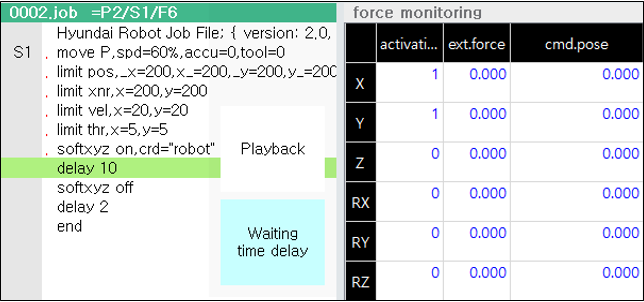

# 6.5.28 힘제어 모니터링
 

## 설명 
* 센서리스 힘제어 기능이 활성화 된 상황에서 [활성화 방향], [외력] 및 [증분 명령] 데이터를 모니터링 

## 파라미터 

 - [activation] : 활성화 된 방향은 1, 비활성화는 0으로 표시  
    - softxyz 기능 사용시 : 직교 좌표계
    - softjoint 기능 사용시 : 축 좌표계
 - [ext.force] : 현재 추정되는 외력 토크 
    - softxyz 기능 사용시 : 위치[N], 방향[Nm]
    - softjoint 기능 사용시 : [Nm]
 - [cmd.pose] : 외력에 따라 이동되는 지령 값
    - softxyz 기능 사용시 : 위치[mm], 방향[deg]
    - softjoint 기능 사용시 : [deg]