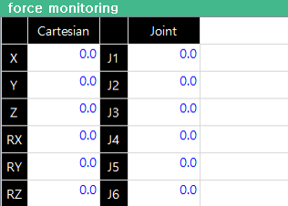

# 6.5.28 force control monitoring
 

#### Description 
* In case of force control, this monitoring data show estimated [external force] 
 
#### Parameters 

 - [cartesian] : external force or torque in cartesian space
    - in case of fctrl function : robot coordinate
    - in case of softxyz function : robot coordinate
    - in case of softjoint function : not shown 
 - [joint] : external torque in joint space    
    - in case of fctrl function : not shown
    - in case of softxyz function : not shown
    - in case of softjoint function : joint coordinate 
