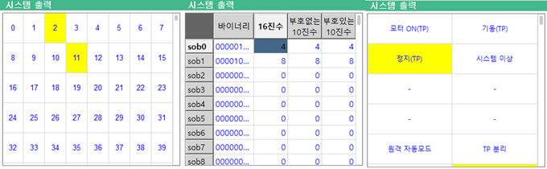
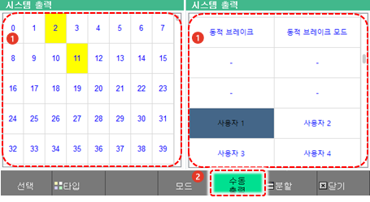
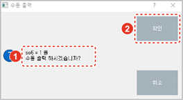

# 6.5 시스템 출력

패널 선택창에서 \[시스템 출력\]을 터치하십시오. 출력 신호창이 나타납니다.

로봇의 운행과 관련된 신호와 브레이크 제어 상태를 확인할 수 있습니다.

* ON/OFF 상태와 시퀀스 상태에서 현재 입력 중인 신호는 노란색으로 표시됩니다.
* 시퀀스 상태에서는 제어기 시퀀스 신호의 상태만 표시합니다.
* \[ON/OFF\]/\[값\]/\[시퀀스\]: 하단의 [모드] 버튼을 터치하여 출력 신호창의 표시 방식을 변경할 수 있습니다.
* \[수동 출력\]: ON/OFF 상태와 시퀀스 상태에서 선택한 신호를 강제로 출력할 수 있습니다.

 

----
## 수동 출력

원하는 신호를 선택하여 강제로 출력할 수 있습니다.

1. 시스템 출력 신호창 우측의 \[ON/OFF\] 또는 \[시퀀스\] 라디오 버튼을 터치하여 표시 방식을 ON/OFF 또는 시퀀스 상태로 설정하십시오.
2. 신호창에서 신호를 터치하여 선택한 후 \[수동 출력\] 버튼을 터치하십시오.

3. 수동 출력 확인창에서 출력 조건을 확인한 후 \[확인\] 버튼을 터치하십시오.

| soN | =1/0 |
| :---: | :---: |
| N: 출력할 신호의 번호 | 출력 상태\(1: 출력, 0: 미출력\) |

4. 선택한 신호의 출력 상태를 확인하십시오. 선택한 신호가 출력 상태로 전환되어 신호창에 노란색으로 표시됩니다.

