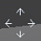

# 6.16 workcell

패널 선택창에서 \[workcell\]을 터치하십시오. 로봇의 현재 자세가 3D 화면에 나타납니다.

협동로봇의 안전 기능을 설정하면 작업 영역\(\)과 툴 영역\(\), 툴 방향 제약\(\), 로봇 엘보우 영역\(\), 금지 영역\(\)의 설정 상태를 확인할 수 있습니다.

* 3D 화면 우측 하단의 \[확대/축소\] 아이콘\(\), \[이동\] 아이콘\(\), 또는 \[회전\] 아이콘\(\)을 선택한 후 화면을 드래그하면 카메라가 조정됩니다.
* 설정을 변경한 경우에는 workcell 창을 닫고 다시 열어야 변경한 설정값이 적용됩니다.

