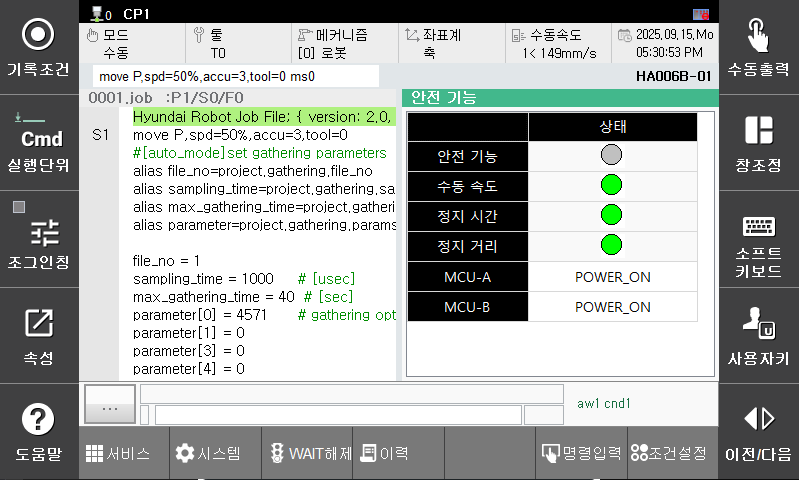

# 6.6 안전 기능

패널 선택창에서 [안전 기능]을 터치하십시오. 안전 기능의 상태창이 나타납니다. 
안전 기능, 수동 속도, 정지 시간, 정지 거리, MCU-A, MCU-B 상태값을 확인할 수 있습니다.

<!--  -->

  

<!-- 
센서 동기 기능에 대한 자세한 내용은 별도의 “[Hi6 센서동기 기능 설명서](https://hrbook-hrc.web.app/#/view/doc-sensor-sync/korean/README)”를 참조하십시오.
 -->

