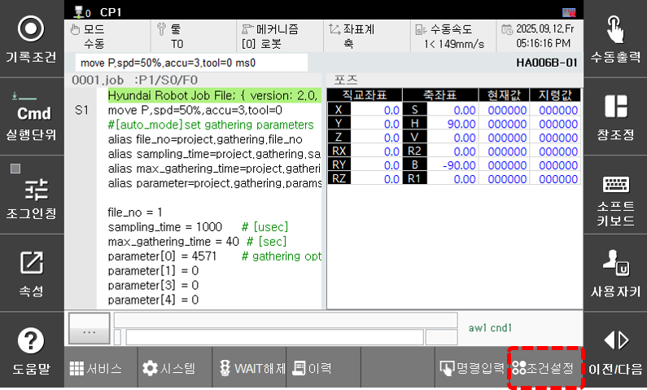



# 6.6 Safety Funtion


This function is supported from the Hi7 controller.


In the panel selection window, touch `[Safety Function]`. Then, the Safety Function status window will appear. 
You can check the status of the Safety Function, Manual Speed, Stop Time, Stop Distance, MCU-A, and MCU-B.


* For details on the Safety Function, refer to the "[SafeSpace2.0 Manual](https://hrbook-hrc.web.app/#/view/doc-safespace2.0/en/README)".


