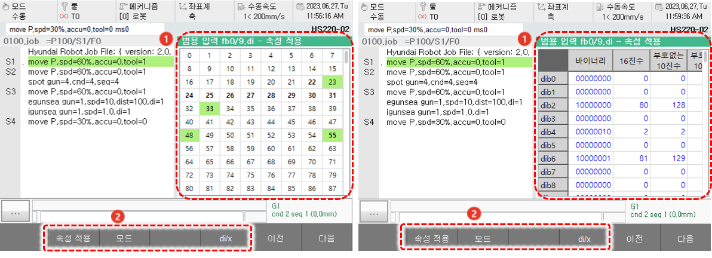

# 6.6 범용 입력

패널 선택창에서 \[범용 입력\]을 터치하십시오. 범용 입력 신호창이 나타납니다.

제어기 내 I/O 보드의 CNIN 커넥터를 통해 입력되는 신호인 범용 입력 신호의 상태를 확인할 수 있습니다.

<table>
  <thead>
    <tr>
      <th style="text-align:left">번호</th>
      <th style="text-align:left">설명</th>
    </tr>
  </thead>
  <tbody>
    <tr>
      <td style="text-align:left">
        
      </td>
      <td style="text-align:left">
        
범용 입력 신호의 상태를
          표시합니다.

        <ul>
          <li>시스템의 기본 사양으로
            지정되거나 사용자에
            의해 할당된 범용 입력
            신호는 굵은 글씨로 표시됩니다.</li>
          <li>현재 입력 중인 신호는
            초록색으로 표시됩니다.</li>
        </ul>
      </td>
    </tr>
    <tr>
      <td style="text-align:left">
        
      </td>
      <td style="text-align:left">
        <ul>
          <li>[속성적용]: 정/부논리
            속성을 입력 상태값에 적용할지 여부를
            설정할 수 있습니다. </li>
          <li>[모드]: 해당 주소의 상태를 비트, 바이트, 워드 단위로 표시합니다.</li>
          <li>[di/x]: 제어기의 논리적인 입력 상태와 PLC에 의한 매핑 상태를 구분하여 표시합니다.</li>
        </ul>
      </td>
    </tr>
  </tbody>
</table>


* 내장 PLC로 필드버스 신호 등을 매핑하여 사용하는 경우에는 입력 신호의 On/Off 상태가 다르게 나타날 수 있습니다.
* 입력 신호의 흐름은 다음과 같습니다. 


