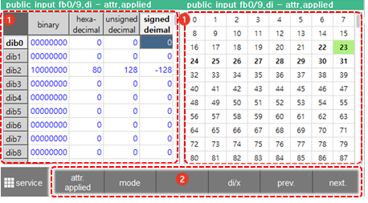
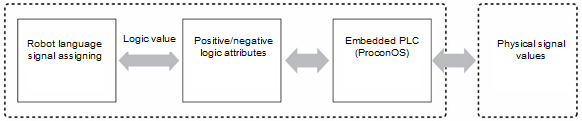

# 6.6 Public Input

Touch \[public Input\] in the panel selection window. Then, the public input signal window will appear. 

You can check the status of public input signals that are inputted through the CNIN connector of the I/O board in the controller.

<table>
  <thead>
    <tr>
      <th style="text-align:left">No.</th>
      <th style="text-align:left">Description</th>
    </tr>
  </thead>
  <tbody>
    <tr>
      <td style="text-align:left">
        
      </td>
      <td style="text-align:left">
        
Displays the status of general input signals

        <ul>
          <li>General input signals designated as the system&#x2019;s basic specifications
            or assigned by the user will be displayed <b>in bold</b>.</li>
          <li>The signals currently being inputted will be displayed in yellow.</li>
        </ul>
      </td>
    </tr>
    <tr>
      <td style="text-align:left">
        
      </td>
      <td style="text-align:left">
        <ul>
          <li>[FB0]: You can select the FB block to monitor by touching the drop-down
            menu (FB0 - FB15). You can configure up to 16 I/O blocks, and 960 points
            of signals can be monitored in</li>
          <li><b>[ATTR.-APPLIED]</b>: You can check the checkbox to perform the setting
            in a way that the physical input values are to be displayed before passing
            through the positive/negative logic attributes. The basic setting (unchecked)
            is that the input logic value after passing through the positive/negative
            logic attributes will be displayed.</li>
          <li>[ON/OFF]/[Value]: You can change the signal display mode by touching the
            radio button.</li>
        </ul>
      </td>
    </tr>
  </tbody>
</table>


* In the case of using signals, such as fieldbus signals, by mapping them using an embedded PLC, the On/Off status of the input signals may appear differently. 
* 
  The flow of the input signals is as follows.


