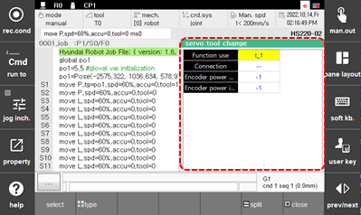

# 6.27 Servo tool change

In the panel selection window, touch \[servo tool change\]. This displays the state of the servo tool and the encoder power supply’s input/output state when the servo tool change function is used.

 

 


 Refer to "Hi6 Controller Servo Tool Change Function Manual" for more details.
