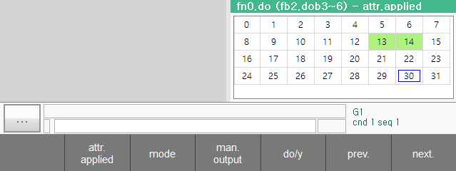

# 6.8 fn input, fn output

You can define fn objects by specifying specific areas of fb objects.
If the Hi6 controller is a fieldbus master, and there are multiple fieldbus slave devices, you can set the areas of each slave device to each fn object to handle these slaves intuitively.

The set fn objects can be used in the same way as the fb objects in the robot language and the embedded PLC.

Select `[fn input]` or `[fn output]` in the panel selection window. The fn input or output panel appears and you can check the values of the input and output signals of each fn object.

Please refer to the link below for how to set up fn object.

[7.3.2.12 fn block allocation](../7-setting/3-control-parameter/2-io-signal-setting/12-fn-block.md)

Click the '[F6:prev]' / '[F7:next]' button to change the number of fn objects to be displayed.

The use of the remaining F buttons is the same as the [Public Input](6-user-input.md ) and [Public Output](6-user-output.md ) monitoring windows.

