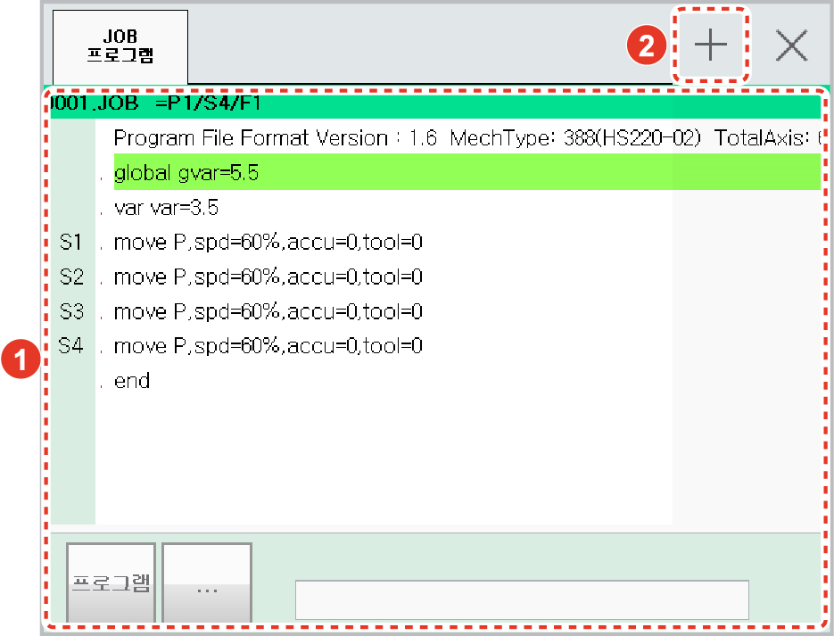
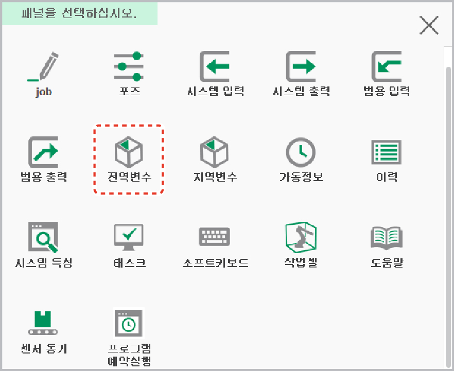
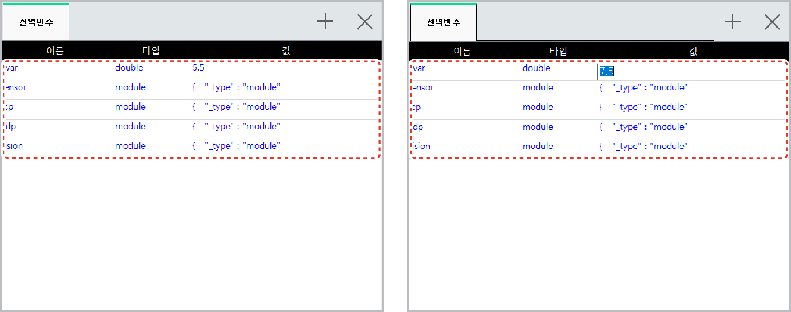

# 6.8 전역변수

JOB 프로그램에 global로 정의된 전역 변수를 확인합니다. 또한 변수값을 선택하여 변경할 수 있습니다.

1.	global로 정의된 전역 변수가 포함된 프로그램을 실행한 후 작업 영역의 패널 스택 우측 상단의 \[+\] 버튼을 터치하십시오.

2.	패널 선택창에서 \[전역변수\]를 터치하십시오. 프로그램에 포함된 전역 변수 목록이 새 창에 나타납니다.

3.	변수 이름과 유형, 값을 확인하십시오. 변수값을 선택하여 변경할 수도 있습니다.

