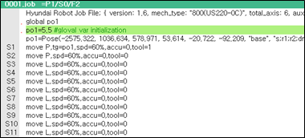
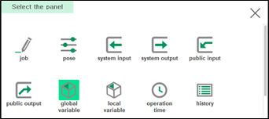
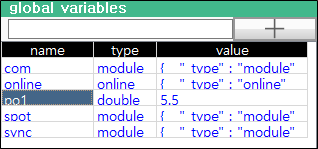

# 6.8 Global Variables

You can check the global variables defined as global in the JOB program. You can also select and change a variable value.

1.	Execute the program that includes the global variables defined as global, and then touch the \[+\] button at the top right of the panel stack in the work area.

    

2.	In the panel selection window, touch \[Global Variable\]. Then, a list of global variables included in the program will appear in a new window.

    

3.	You can check the name, type, and value of a variable. You can also select and change the value of a variable.

    

