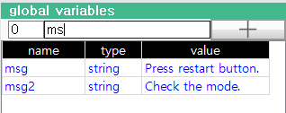
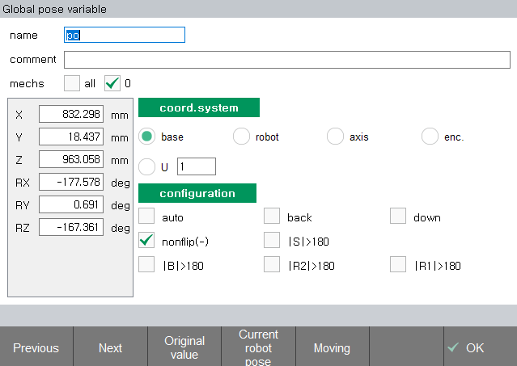
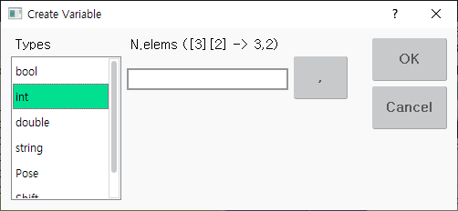
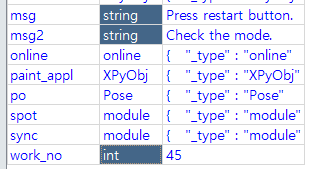
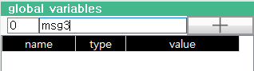
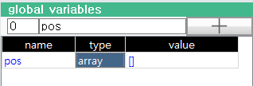

# 6.8 Global Variables

Displays a list of all global variables. You can also create/delete variables and edit types and values.

## Open global variable panel

1. Split the screen and press the [Select] button at the bottom left.

&nbsp;

2. In the panel selection window, touch \[global variable\]. The `global variables` panel opens.

## Finding a variable

If it is difficult to find the desired variable due to a large number of variables, type only a few of the variable's name in the filter at the top. Only variables that start with the filter string you enter appear on the screen, making it easy to find them.

## Changing the value of a variable (for bool, int, double, string type)

Select the `value` column for the desired variable and type the new value.
Press the ENTER key to apply the entered value to the variable.

## Changing the value of a variable (for pose, shift type)

Select the `value` column for the desired pose or shift variable.

Press the ENTER key to open the Pose or Shift Property window.
After edit it, click the [F7: OK] button.

## Changing a variable type

Select the `type` column for the desired variable and press ENTER. The Create Variable dialog box appears as shown below.

Select the desired type from the Type list and click the OK button to change the type of the variable. Note that the value will be initialized if the type changes.

You can also select a type for multiple variables and press ENTER to change them all at once.
(You can select multiple consecutive cells by pressing the SHIFT+Up/Down arrow keys. Alternatively, you can select by touching multiple cells while holding down the CTRL key.)

## Renaming a variable

Select the `name` column for the variable you want, then open the soft keyboard to type the new name.
Press the ENTER key to change it to the name you entered.

## Creating a variable

In the filter at the top, enter the name of the variable you want to create.

Verify that there are no variables with duplicate names, then click the + button next to the filter. The variable is created with the default type `int` (integer). Change the type of variables created using the method explained above.

## Deleting a variable

Select the variable you want to delete.
Press the DEL (CTRL+BACKSPACE) key to display the OK/Cancel dialog box. After confirming the variable name, press the OK button.

## Creating an array

We will now use an example of generating a 5x200 two-dimensional pose array variable named `pos`.
Create a variable named `pos` using the method described above.

Select the `type` column and press the ENTER key. The Create Variable dialog box appears as shown below.

Select `Pose` in the Type list. If you enter 5,200 for the number of elements and press the OK button, the type of pos changes to the array of Pose[5][200].

## Viewing and changing the array element value

The value of the array variable is displayed only as [], and the values of the elements are not displayed.
Select the `value` column and press the ENTER key or click the [F5: sub.level] button to expand the array to a lower level and view the element values.

You can also change the value or type for array elements in the way described above.  

In a 2-dimensional array `pos`, `pos[0]` ~ `pos[4]` are also arrays. Press ENTER or [F5] to continue down to the lower level. The level and index of the array currently displayed can be found in the global variables panel's title bar.

Click the [F4: up.level] button or press the ESC key to go back up to the higher level.

Because the array displays only 100 elements at the same time, by default you can only see the range of [0] to [99] indexes. If you change the value of the Start Index editbox in the upper left corner, you can see other ranges of elements. For example, if you enter 190 in the Start Index at `/pos[4]`, you can see the elements of [190]~[199].

## Viewing and changing object property values

Select the `value` column of the object variable and press the ENTER key or click the [F5: sub.level] button to expand the object to a lower level and view the property values. The operation method is similar to the array variable. However, the Startup Index editbox is not used.

