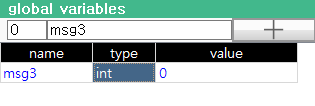
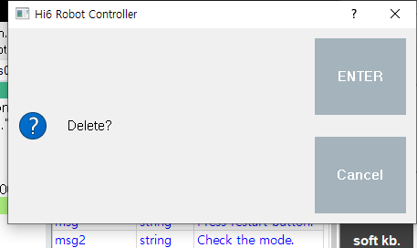
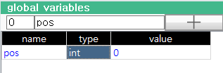
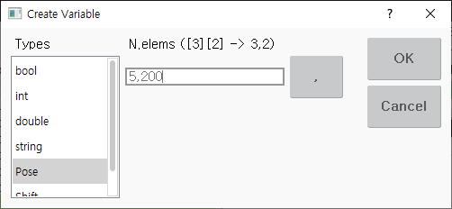
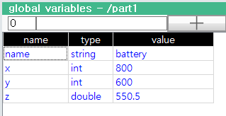

# 6.8.1 기본 기능

## 변수 찾기

변수의 개수가 많아서 원하는 변수를 찾기가 어려울 때는 상단의 필터에 변수의 이름을 일부만 타이핑하십시오. 입력한 필터 문자열로 시작하는 변수만 화면에 표시되므로, 변수를 쉽게 찾을 수 있습니다.

## 변수 값 변경하기 (bool, 정수, 실수, 문자열 타입의 경우)

원하는 변수의 값 열을 선택하고 새로운 값을 타이핑하십시오.
ENTER키를 누르면 입력한 값이 해당 변수에 대입됩니다.

## 변수 값 변경하기 (포즈, 시프트 타입의 경우)

원하는 포즈나 시프트 변수의 값 열을 선택합니다.

ENTER키를 누르면 포즈 혹은 시프트 속성 창이 열립니다.
편집을 수행한 후, F7: 확인 버튼을 클릭합니다.

## 변수 타입 변경하기

원하는 변수의 타입 열을 선택하고 ENTER키를 누릅니다. 아래와 같이 변수 생성하기 대화상자가 나타납니다.

타입 리스트에서 원하는 타입을 선택하고 확인 버튼을 클릭하면, 해당 변수의 타입이 변경됩니다. 타입이 바뀌면 값은 초기화 되므로 유의하십시오.

여러 개의 변수에 대해 타입을 선택한 후 ENTER키를 눌러 한꺼번에 변경할 수도 있습니다.
(SHIFT+상하 화살표키를 눌러 연속된 여러 개의 셀을 선택할 수 있습니다. 혹은 CTRL키를 누른 채 원하는 셀들을 여러 개 터치하여 선택할 수 있습니다.)

## 변수 이름 변경하기

원하는 변수의 이름 열을 선택한 후 소프트키보드를 열어 새로운 이름을 타이핑하십시오.
ENTER키를 누르면 입력한 이름으로 변경됩니다.

## 변수 생성하기

상단의 필터에 변수의 생성할 변수의 이름을 입력합니다.

중복된 이름의 변수가 없는 것을 확인한 후 필터 옆의 + 버튼을 클릭하면, 변수가 디폴트 타입 int(정수)로 생성됩니다. 위에서 설명한 방법으로 생성된 변수를 원하는 타입으로 변경하십시오.

## 변수 삭제하기

삭제할 변수를 선택합니다.
DEL(CTRL+BACKSPACE) 키를 누르면 확인/취소 대화상자가 나타납니다. 변수명을 확인한 후, 확인 버튼을 누르십시오.

## 배열 생성하기

pos라는 이름의 5x200의 2차원 포즈 배열 변수를 생성하는 예로 설명하겠습니다.
위에서 설명한 방법으로 pos라는 이름의 변수를 생성합니다.

타입 열을 선택하고 ENTER키를 누릅니다. 아래와 같이 변수 생성하기 대화상자가 나타납니다.

타입 리스트에서 포즈를 선택합니다. 요소 개수에 5,200을 입력하고 확인 버튼을 누르면, pos의 타입이 Pose[5][200]의 배열로 변경됩니다.

## 배열 요소값 확인하고 변경하기

배열 변수의 값은 [ ]로만 표시되고 요소들의 값은 표시되지 않습니다.
값 열을 선택하고 ENTER키를 누르거나 F5: 하위레벨 버튼을 클릭하면 배열이 하위레벨로 펼쳐지면서 요소 값들을 볼 수 있습니다.  

배열 요소에 대해서도 위에서 설명한 방법으로 값이나 타입을 변경할 수 있습니다.  

2차원 배열 pos에서 pos[0]~pos[4] 또한 배열들입니다. ENTER키나 F5키를 눌러 하위레벨로 계속 내려갈 수 있습니다. 현재 표시되고 있는 배열의 레벨과 인덱스는 전역변수창 제목막대에서 확인할 수 있습니다.

F4: 상위레벨 버튼을 클릭하거나 ESC키를 누르면 다시 상위레벨로 올라갑니다.

배열은 동시에 100개의 요소만 표시되기 때문에, 기본적으로 [0]~[99] 인덱스 범위만 볼 수 있습니다. 좌상단의 시작 인덱스 편집박스의 값을 바꾸면 다른 범위의 요소도 확인 가능합니다. 예를 들어 /pos[4]에서 시작 인덱스에 190을 입력하면, [190]~[199]의 요소를 볼 수 있습니다.

## 객체 속성값 확인하고 변경하기

객체 변수의 값 열을 선택하고 ENTER키를 누르거나 F5: 하위레벨 버튼을 클릭하면 객체가 하위레벨로 펼쳐지면서 속성 값들을 볼 수 있습니다. 조작방식은 배열과 거의 유사합니다. 단 시작 인덱스 편집박스는 사용되지 않습니다.

