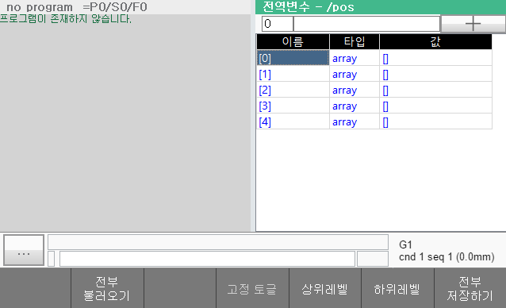

# 6.8.2 배열과 객체

## 배열 생성하기

pos라는 이름의 5x200의 2차원 포즈 배열 변수를 생성하는 예로 설명하겠습니다.
위에서 설명한 방법으로 pos라는 이름의 변수를 생성합니다.


타입 열을 선택하고 ENTER키를 누릅니다. 아래와 같이 변수 생성하기 대화상자가 나타납니다.


타입 리스트에서 포즈를 선택합니다. 요소 개수에 5,200을 입력하고 확인 버튼을 누르면, pos의 타입이 Pose[5][200]의 배열로 변경됩니다.



\[경고\] 지나치게 큰 배열을 정의하면, 저장이나 불러오기에 소요되는 시간이 길어지고 정전시의 자동 저장이 실패할 수 있으므로 유의하십시오.



## 배열 요소값 확인하고 변경하기

배열 변수의 값은 []로만 표시되고 요소들의 값은 표시되지 않습니다.
값 열을 선택하고 ENTER키를 누르거나 [F6: 하위레벨] 버튼을 클릭하면 배열이 하위레벨로 펼쳐지면서 요소 값들을 볼 수 있습니다.  



배열 요소에 대해서도 위에서 설명한 방법으로 값이나 타입을 변경할 수 있습니다.  

2차원 배열 pos에서 pos[0]~pos[4] 또한 배열들입니다. ENTER키나 F6키를 눌러 하위레벨로 계속 내려갈 수 있습니다. 현재 표시되고 있는 배열의 레벨과 인덱스는 전역변수창 제목막대에서 확인할 수 있습니다.

[F5: 상위레벨] 버튼을 클릭하거나 ESC키를 누르면 다시 상위레벨로 올라갑니다.


배열은 동시에 100개의 요소만 표시되기 때문에, 기본적으로 [0]~[99] 인덱스 범위만 볼 수 있습니다. 좌상단의 시작 인덱스 편집박스의 값을 바꾸면 다른 범위의 요소도 확인 가능합니다. 예를 들어 /pos[4]에서 시작 인덱스에 190을 입력하면, [190]~[199]의 요소를 볼 수 있습니다.


## 객체 속성값 확인하고 변경하기

객체 변수의 값 열을 선택하고 ENTER키를 누르거나 F5: 하위레벨 버튼을 클릭하면 객체가 하위레벨로 펼쳐지면서 속성 값들을 볼 수 있습니다. 조작방식은 배열과 거의 유사합니다. 단 시작 인덱스 편집박스는 사용되지 않습니다.


<br>

## 고정 변수(fixed-variable)

가령 전역변수 창에서 `weld_points`라는 대량의 포즈를 작성했는데, 아래와 같은 대입문 수행에 의해 모든 데이터가 삭제될 수 있습니다.

```python
weld_points=0
```

변수를 고정(fixed)으로 지정하면 이러한 실수를 방지할 수 있습니다.


전역변수 창의 최상위 레벨에서 배열 변수를 선택하고 [F4: 고정 토글]을 누르면, 타입이 `array`에서 `F.array` (fixed-array)로 변경됩니다.
고정 변수로 지정되면, 대입문으로 다른 값을 대입할 수 없습니다. `weld_points`가 fixed 2차원 배열일 때, 아래 각 대입문의 결과는 주석과 같습니다.

```python
global weld_points  # 무시됨.
global weld_points=0  # 대입 불가 에러 발생
weld_points=0  # 대입 불가 에러 발생
weld_points[2]=Array[30]  # 요소에 새로운 값 대입 가능
weld_points[2][1]="light"  # 요소에 새로운 값 대입 가능
weld_points[2][1].j2=90.5  # 속성에 새로운 값 대입 가능
```

[F4: 고정 토글]을 한번 더 수행하면 고정이 해제되면서 `F.array`가 다시 `array`로 원상복구됩니다.
