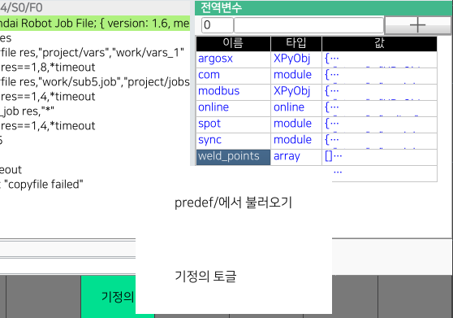
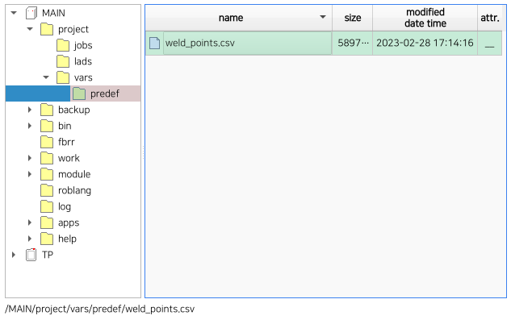
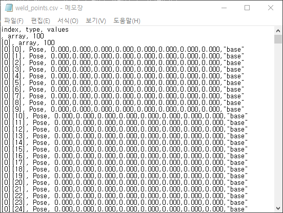
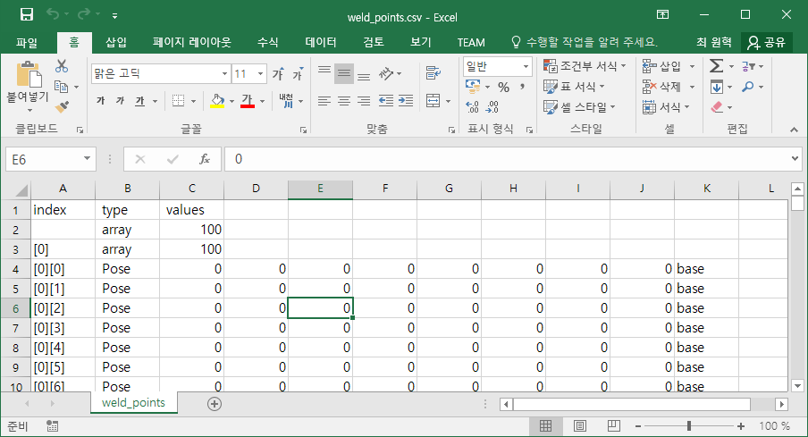

# 6.8.2 기정의변수(predefined-variable) 기능

고정된 개수의 대량의 포즈 혹은 시프트 데이터를 별도의 텍스트파일로 편집해가며 관리해야 한다면, 기정의 변수를 만드는 것이 효율적입니다.

## 기정의 변수로 만들기

`weld_points`라는 이름의 100x100 크기의 전역 2차원 배열 포즈의 예로 설명하겠습니다.

`weld_points`를 선택하고 [F3: 기정의] 버튼을 클릭합니다. 팝업 메뉴에서 `기정의 토글`을 선택하면 타입이 `array`에서 `pd.array` (predef.array)로 변경됩니다.



`기정의 토글`를 한번 더 수행하면 `pd.array`가 다시 `array`로 원상복구됩니다.



\[경고\] 지나치게 큰 배열을 정의하면, 저장이나 불러오기에 소요되는 시간이 길어지고 정전시의 자동 저장이 실패할 수 있으므로 유의하십시오.


<br>

## 기정의 변수의 특징

일반적인 전역변수 대비 기정의 변수는 아래와 같은 차이점과 제약을 갖습니다.

1) `MAIN/project/vars/predef/` 폴더에 .csv 파일로 저장됩니다. 텍스트 편집기로 편집하기 쉬운 직관적인 형식입니다.
2) 전역변수 배열만 기정의 변수로 만들 수 있습니다. int, string 등 기본형이나 객체는 기정의 변수로 만들 수 없습니다. 지역변수들도 불가합니다.
3) 전역변수창 U/I로만 변수를 기정의로 만들 수 있습니다. 변수를 기정의로 만드는 로봇언어 명령문은 없습니다.
4) 대입문으로 다른 값을 대입할 수 없습니다. `weld_points`가 predef 2차원 배열일 때;

```python
global weld_points  # 무시됨.
global weld_points=0  # 대입 불가 에러 발생
weld_points=0  # 대입 불가 에러 발생
weld_points[2]=Array[30]  # 요소에 새로운 값 대입 가능
weld_points[2][1]="light"  # 요소에 새로운 값 대입 가능
weld_points[2][1].j2=90.5  # 요소에 새로운 값 대입 가능
```

<br>

## predef/.csv 파일

파일관리자에서 `MAIN/project/vars/predef/` 폴더를 열어보면 `weld_points.csv`라는 파일이 생성되어 있습니다. 기정의로 지정한 변수들은 변수명과 동일한 .csv 파일이 생성되며, 기정의에서 해제하면 해당 파일은 자동으로 삭제됩니다.



이 파일을 USB 메모리나 FTP로 복사하여 PC에서 열어봅시다. .csv 파일은 Comma-Separated Values 즉, 쉼표로 구분된 값들을 표현하는 아주 단순한 표준 텍스트 포맷입니다.

참고 : [위키백과: CSV (파일 형식)](https://ko.wikipedia.org/wiki/CSV_(%ED%8C%8C%EC%9D%BC_%ED%98%95%EC%8B%9D))

.csv 파일은 하나의 2차원 표를 표현하는데, 열은 쉼표로 구분하고 행은 개행으로 구분합니다.



기정의 변수를 저장한 csv 파일은 `weld_points` 2차원 배열을 만들어가는 과정이 순서대로 나열되어 있습니다.

각 행은 1번 째 열은 인덱스, 2번 째 열은 타입, 3번 째~마지막 열은 값입니다. 첫 행은 표의 헤더로서 이를 설명하고 있습니다.

둘 째 행은 최상위 레벨, 즉 `weld_points` 자신을 만드는 행입니다. 따라서 인덱스 열은 비어 있고, 타입은 array, 개수는 100입니다. 즉, 일단 `weld_points[100]`이 만들어지며, 100개의 요소는 기본값인 0들로 채워집니다.

```python
, array, 100
```

다음 행들은 `weld_points[0]`의 요소들에 포즈타입 값을 생성해 대입하는 행입니다.

```python
[0][0], Pose, 0.000, 0.000, 0.000, 0.000, 0.000, 0.000, "base"
[0][1], Pose, 0.000, 0.000, 0.000, 0.000, 0.000, 0.000, "base"
...
```

`weld_points[0]`에 대해 100개의 행이 수행되면 다음은 아래와 같이 `weld_points[1]`에 대한 처리를 수행하는 행들이 이어집니다.

```python
[1], array; 100
[1][0], Pose; 0.000, 0.000, 0.000, 0.000, 0.000, 0.000, "base"
[1][1], Pose; 0.000, 0.000, 0.000, 0.000, 0.000, 0.000, "base"
[1][2], Pose; 0.000, 0.000, 0.000, 0.000, 0.000, 0.000, "base"
...
```

.csv 파일을 파일관리자에서 더블클릭하여, Microsof Excel로 열어 편집할 수 있습니다. 편집이 끝나면 저장 버튼이나 `Ctrl+S`로 저장하십시오.



Excel에서 저장하면 아래와 같이 불필요한 쉼표도 생기고, 좌표계의 따옴표도 사라져서 형식이 약간 변화합니다. Excel이 .csv를 처리하는 방식이므로 어쩔 수 없습니다. 어쨌든 Hi6 제어기는 아래의 형식도 인식하므로 상관없습니다.

```python
, array,100,,,,,,
[0], array,100,,,,,,
[0][0], Pose,0,90,10,0,20,0,
[0][1], Pose,0,0,0,0,0,0,base
[0][2], Pose,0,10,0,0,0,0,robot
[0][3], Pose,0,20,0,0,0,0,base
[0][4], Pose,0,0,0,0,0,0,base
[0][5], Pose,0,0,0,0,0,0,base
```

<br>

## .csv 불러오기

편집한 파일을 다시 `MAIN/project/vars/predef/` 에 덮어쓸 수 있지만, 메모리에 자동 반영되지는 않습니다.

전역변수 창에서 [F3: 기정의] 버튼을 클릭하십시오. 팝업 메뉴에서 `predef/에서 불러오기`를 선택하면, `predef/` 폴더의 모든 파일을 메모리로 다시 불러옵니다.
(.csv 파일이 존재하는 변수는 기정의 변수가 되고, .csv 파일이 없는 변수는 기정의 변수에서 해제됩니다.)


