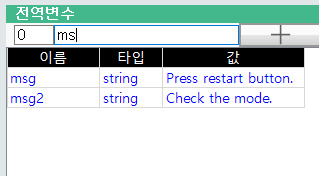
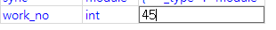
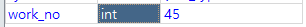
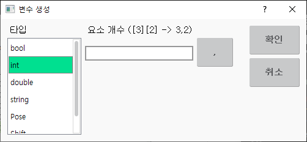
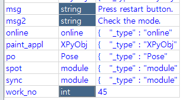
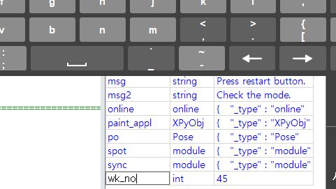
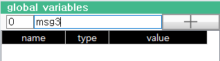
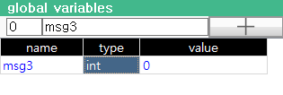
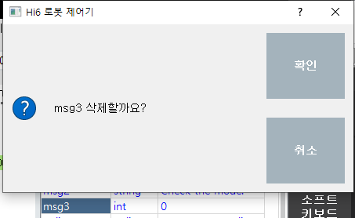

# 6.9.1 Basic features

## Finding a variable

If it is difficult to find the desired variable due to a large number of variables, type only a few of the variable's name in the filter at the top. Only variables that start with the filter string you enter appear on the screen, making it easy to find them.

## Changing the value of a variable (for bool, int, double, string type)

Select the `value` column for the desired variable and type the new value.
Press the ENTER key to apply the entered value to the variable.

## Changing the value of a variable (for pose, shift type)

Select the `value` column for the desired pose or shift variable.

Press the ENTER key to open the Pose or Shift Property window.
After edit it, click the [F7: OK] button.

## Changing a variable type

Select the `type` column for the desired variable and press ENTER. The Create Variable dialog box appears as shown below.

Select the desired type from the Type list and click the OK button to change the type of the variable. Note that the value will be initialized if the type changes.

You can also select a type for multiple variables and press ENTER to change them all at once.
(You can select multiple consecutive cells by pressing the SHIFT+Up/Down arrow keys. Alternatively, you can select by touching multiple cells while holding down the CTRL key.)

## Renaming a variable

Select the `name` column for the variable you want, then open the soft keyboard to type the new name.
Press the ENTER key to change it to the name you entered.

## Creating a variable

In the filter at the top, enter the name of the variable you want to create.

Verify that there are no variables with duplicate names, then click the + button next to the filter. The variable is created with the default type `int` (integer). Change the type of variables created using the method explained above.

## Deleting a variable

Select the variable you want to delete.
Press the DEL (CTRL+BACKSPACE) key to display the OK/Cancel dialog box. After confirming the variable name, press the OK button.

