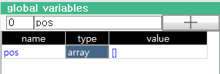

# 6.9.2 Array and object

## Creating an array

We will now use an example of generating a 5x200 two-dimensional pose array variable named `pos`.
Create a variable named `pos` using the method described above.


Select the `type` column and press the ENTER key. The Create Variable dialog box appears as shown below.


Select `Pose` in the Type list. If you enter 5,200 for the number of elements and press the OK button, the type of pos changes to the array of Pose[5][200].




\[Warning\] Be aware that defining an array that is too large may take longer to save or load and may fail to save automatically in the event of a power failure.



## Viewing and changing the array element value

The value of the array variable is displayed only as [], and the values of the elements are not displayed.
Select the `value` column and press the ENTER key or click the [F5: sub.level] button to expand the array to a lower level and view the element values.


You can also change the value or type for array elements in the way described above.  

In a 2-dimensional array `pos`, `pos[0]` ~ `pos[4]` are also arrays. Press ENTER or [F5] to continue down to the lower level. The level and index of the array currently displayed can be found in the global variables panel's title bar.

Click the [F4: up.level] button or press the ESC key to go back up to the higher level.


Because the array displays only 100 elements at the same time, by default you can only see the range of [0] to [99] indexes. If you change the value of the Start Index editbox in the upper left corner, you can see other ranges of elements. For example, if you enter 190 in the Start Index at `/pos[4]`, you can see the elements of [190]~[199].

## Viewing and changing object property values

Select the `value` column of the object variable and press the ENTER key or click the [F5: sub.level] button to expand the object to a lower level and view the property values. The operation method is similar to the array variable. However, the Startup Index editbox is not used.


<br>

## Fixed-variable

For example, you have created a large number of poses named `weld_points` in the Global Variables window, and by executing below assignment statement all data can be deleted.

```python
weld_points=0
```

By specifying the variable as fixed, you can prevents this mistake.


If you select an array variable at the top level of the Global Variables window and press [F4: toggle fixed], the type changes from 'array' to 'F.array' (fixed-array).  
If specified as a fixed variable, no other value can be assigned. When `weld_points` is a fixed 2-dimensional array, the result of each assignment statement below is the same as the comment.


```python
global weld_points  # ignored.
global weld_points=0  # cannot assign error occurs
weld_points=0  # cannot assign error occurs
weld_points[2]=Array[30]  # new value can be assigned to an element
weld_points[2][1]="light"  # new value can be assigned to an element
weld_points[2][1].j2=90.5  # new value can be assigned to an property
```

If [F4: toggle fixed] is performed again, fixed will be released and `F.array` will be restored to `array`.
