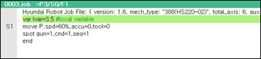
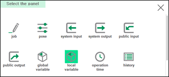
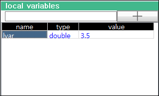

# 6.9 Local Variables

You can check the local variables defined as 'var' in the JOB program. You can also select and change a variable value.

1.	Execute the program that includes the local variables defined as 'var', and then touch the \[+\] button at the top right of the panel stack in the work area.

    

2.	In the panel selection window, touch \[Local Variable\]. Then, a list of local variables included in the program will appear in a new window.

    

3.	You can check the name, type, and value of a variable. You can also select and change the value of a variable.

    

