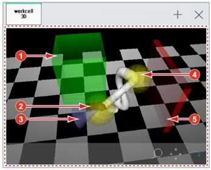

# 6.15 工作单元

此功能正在开发中。完成后，将更新内容。

---

在面板选择窗口中，触摸 `[Work Cell]`。然后，机器人的当前姿势将出现在 3D 屏幕上。

通过设置协作机器人的安全功能，您可以检查操作区域 \(\)、工具区域 \(\)、工具方向限制 \(\)、机器人肘部区域 \(\)、禁止区域 \(\) 的设置状态。

* 选择右下角 3D 屏幕上的 `[Upscale/Downscale]` 图标 \(\)、`[Move]` 图标 \(\) 或 `[Rotate]` 图标 \(\)，然后拖动屏幕。然后，相机将被调整。
* 如果设置已更改，您可以在关闭并重新打开工作单元窗口后应用新设置。