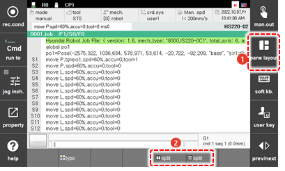
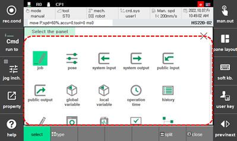

# 6. 监控

您可以检查机器人系统的状态以及控制器的各种数据。

1. 按顺序触摸面板右上角的`[pane layout]`按钮，底部的[split]，以及左下角的[select]。面板选择窗口将出现。

    

2. 触摸您想要监控的项目并检查显示的数据。

    


* 所有可以监控的项目将在面板选择窗口中显示。
* 
  可监控的项目将根据控制器的设置以不同方式显示。 

* 
  有关如何使用面板堆栈和工作区窗口的详细信息，请参阅 "[1.2.3.8 任务编辑窗口](../1-robot-system/2-basic-usage/4-screen-of-the-hi6-tp/8-work-area?cont_model=${cont_model})"。
