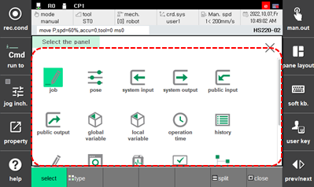

# 6. Monitoring

You can check the status of the robot system and various data of the controller.

1.	In order, touch the \[pane layout\] button at the top right of the panel,[split] at the bottom, and [select] at the left bottom. The panel selection window will appear.

    

2.	Touch the monitoring item that you want and check the displayed data.

    


* All items that can be monitored will be displayed on the panel selection window.
* 
  The items that can be monitored will be displayed differently depending on the setting of the controller. 

* 
  For details on how to use the panel stack and window of the work area, refer to "[1.2.3.8 Task edit window](../1-robot-system/2-basic-usage/4-screen-of-the-hi6-tp/8-work-area.md)".

