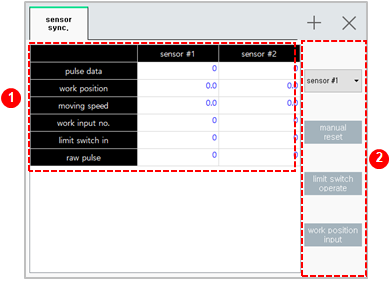

# 6.18 Sensor Sync

Touch \[Sensor Sync\] in the panel selection window. Then, the sensor sync window will appear.

You can check the information related to the conveyor and press sync functions. The sensor sync function can be activated by setting the sync status as conveyor or press in the \[Set up&gt; 4: Application Parameter &gt; 4: Sensor Sync\] menu.

<table>
  <thead>
    <tr>
      <th style="text-align:left">No.</th>
      <th style="text-align:left">Description</th>
    </tr>
  </thead>
  <tbody>
    <tr>
      <td style="text-align:left">
        
      </td>
      <td style="text-align:left">Displays the information related to the conveyor and press sync functions
        of the selected sensor</td>
    </tr>
    <tr>
      <td style="text-align:left">
        
      </td>
      <td style="text-align:left">
        <ul>
          <li><b>[Sensor #1]</b>: You can select a sensor to monitor by touching the
            drop-down menu.</li>
          <li><b>[Manual reset]</b>: You can manually delete various sensor-related
            data (encoder pulse, sensor position, sensor speed, workpiece entry count,
            sync playback status, etc.).</li>
          <li><b>[Limit Switch Operate]</b>: You can use this function when you input
            the l</li>
          <li><b>[Work Position Input]</b>: You can manually input the sensor position
            value (Linear: mm. Circular: deg).</li>
        </ul>
      </td>
    </tr>
  </tbody>
</table>


For details on the sensor sync function, refer to the “Hi6 Sensor Sync Function Manual.”


