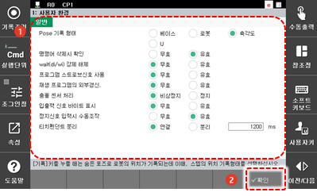
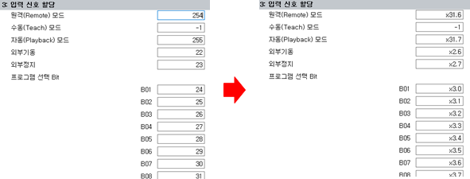

# 7.2 사용자 환경

각종 사용자 조건을 확인하고 설정합니다.

1.	\[1: 사용자 환경\] 메뉴를 터치하십시오. 사용자 환경 설정창이 나타납니다.

2.	사용자 환경을 설정한 후 \[**확인**\] 버튼을 터치하십시오.

* \[1: Pose 기록 형태\]: 숨은 포즈로 기록되는 스텝의 위치 기록 형태를 설정합니다. ("[2.3.1.2 포즈](../2-operation/3-step/1-step-cmd-param/2-pose.md)")
  * \[베이스\]/\[로봇\]/\[축각도\]: 베이스 좌표, 로봇, 축각도 값을 기준으로 스텝의 위치를 기록합니다
  * \[U\]: 사용자 좌표계에서의 위치를 기록합니다.
* \[2: 명령어 삭제시 확인\]: 수동 모드에서 명령문 삭제 시 삭제 확인창의 노출 여부를 설정합니다.
* \[3: WAIT\(DI/WI\) 강제해제\]: 입력 신호 대기 또는 용접 완료 신호 대기에서 &lt;shift+F3: WAIT 해제&gt; 키를 이용해 신호 대기 상태의 강제 해제 여부를 설정합니다.
* \[4: 프로그램 스트로브신호 사용\]: 외부 디지털 신호를 수신하여 외부 프로그램 선택 시 외부 프로그램이 선택되는 시점을 설정합니다.
  * \[무효\]: 외부 프로그램 선택 신호만을 읽어 들여 외부 프로그램을 선택합니다.
  * \[유효\]: 프로그램 스트로브가 입력되는 시점에 외부 프로그램 선택 신호를 읽어 들여 외부 프로그램을 선택합니다.

* \[5: 재생 프로그램의 외부갱신\]: 재생 중인 프로그램을 외부\(PC\)에서 수정하여 제어기로 다운로드하는 것의 허용 여부를 설정합니다. \(재생 중인 프로그램 번호에 대해 새로 다운로드된 프로그램은 다음 사이클부터 적용됩니다.\)


재생 중인 프로그램을 외부\(PC\)에서 수정하여 제어기로 다운로드하면 제품이 고장 나거나 성능에 이상이 발생할 수 있습니다. 고객지원팀에 문의하여 전문가에게 의뢰하거나 엔지니어에게 문의하십시오.


* \[6: 충돌센서\]: 충돌 센서 동작 시 로봇을 정지시키는 방법을 설정합니다.
  * \[\(1\) 센서처리\]: 충돌 센서가 동작하면 로봇을 비상 정지\(운전 준비 OFF \(모터 OFF\) 상태\)하거나 정지\(운전 준비 ON \(모터 ON\) 상태\)시킵니다.
  * \[\(2\) 신호논리\]: 충돌 센서의 입력 신호 논리를 정논리 또는 부논리로 설정합니다.


* 충돌 센서 작동으로 모터가 꺼진 상태에서 \[설정\] 메뉴에 진입하면 모터 ON 및 조그 동작이 가능합니다. 이를 이용하여 충돌한 로봇을 이동시킬 수 있습니다.
* \[센서처리\]가 정지로 설정된 상태에서 충돌 센서가 동작하면 로봇은 조그 동작만 가능합니다.


* \[7: 입출력 신호 바이트 표시]: 입출력 신호를 바이트 단위로 표시합니다.
  * 유효로 선택한 경우, 입력 신호 할당 페이지의 설정화면이 아래와 같이 변경됩니다.
  

* \[8: 정지신호 입력시 수동조작\]: 외부 정지 신호 입력 시 조그 동작의 가능 여부를 설정합니다.

* \[9: 티치펜던트 분리\]: 외부 정지 신호 입력 시 조그 동작의 가능 여부를 설정합니다.
  * 제어기에서 티치펜던트를 제거한 상태로 로봇을 자동운전하기 위하여 설정합니다. <유효>로 설정하면 티치펜던트와 메인보드간 통신이 끊어졌을 때 발생하는“E0015 Teaching pendant 동작이상”에러도 발생하지 않습니다. 
  * <유효>로 설정하고, 제어기에서 티치펜던트를 제거한 상태로 전원을 투입하면 제어기는 현재 모드를 원격모드로 인식하고 외부 모터 ON, 외부 기동에 의해 로봇을 자동운전 할 수 있습니다.
  * 티치펜던트에는 비상정지 스위치, 모드변환 스위치가 별도 신호 선으로 연결되어 있기 때문에 이 신호 선을 적절하게 결선해야 합니다.
  * CNRTP 콘넥터의 핀 9번(Auto)을 2번(M1)에 연결하고, 핀 5번(비상정지1)을 2번(M1)에 연결하고, 핀 6번(비상정지2)을 1번(P1)에 연결한 전용 CNRTP 콘넥터를 티치펜던트 대신 접속해주시기 바랍니다.
