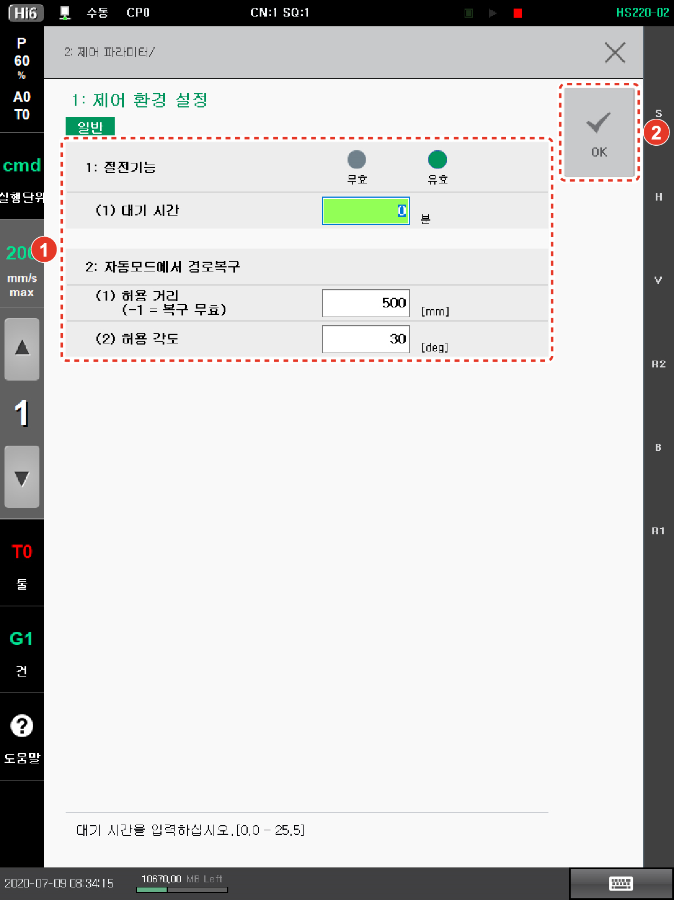

# 7.3.1 제어 환경 설정

제어기의 각종 조건을 설정하여 필요한 작업을 수행합니다.

1.	\[2: 제어 파라미터 &gt; 1: 제어 환경 설정\] 메뉴를 터치하십시오.

2.	제어기의 제어 환경 조건을 설정한 후 \[OK\] 버튼을 터치하십시오.

* \[1: 절전기능\]: 절전 기능의 사용 여부와 대기 시간을 설정합니다.

절전 기능을 사용 설정하면, 자동 모드에서 로봇이 기동 대기, 입력 신호 대기 등의 장시간 동안 운전 정지 상태에 있는 경우 대기 시간이 경과하면 모터의 전원 공급을 차단하여 소비 전력을 절약합니다. 로봇에 운전 명령이 입력되면 자동적으로 절전 기능이 해제되어 모터에 전원을 공급하고 로봇이 동작합니다.


절전 기능이 활성화/비활성화되는 과정에서 지연 요소가 발생할 수 있습니다. 로봇의 속도를 예상하여 작업하는 경우에는 절전 기능을 무효로 설정하여 작업하십시오.


* \[2: 자동모드에서 경로복구\]: 자동 모드에서 경로 복구 시의 허용 거리와 허용 각도를 설정합니다. 경로 복구 시 거리 및 각도가 설정된 허용 범위 이상인 경우 에러를 검출합니다. 허용 거리를 -1로 설정하면 경로를 복구하지 않습니다.

