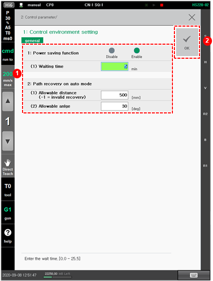

# 7.3.1 Control Environment Setting

You can set various conditions of the controller and perform necessary operations.

1.	Touch the \[2: Control Parameter &gt; 1: Control Environment Setting\] menu.

2.	After setting the control environment conditions of the controller, touch the \[OK\] button.

* \[Power Saving Function\]: You can set whether to use the power saving function and set the wait time.

While the power saving function is used, if the robot is in operation stop status while in the auto mode for a long period, such as waiting for startup or waiting for an input signal, the power supply to the motor will be cut off when the wait time has expired, helping save power consumption. When an operation command is inputted in the robot, the power saving function will be automatically deactivated, allowing the power to be supplied to the motor and the robot to operate.


Delays may occur in the process of activating/deactivating the power-saving function. When operating while expecting the speed of the robot, you should set the power saving function as disable.


* \[Path Recovery on Auto Mode\]: You can set the allowable distance and allowable angle for path recovery in automatic mode.

  During path recovery, an error will be detected if the distance and angle exceed the set allowable range. If the allowable distance is set to 1, no path recovery will take place.

* \[Cooling fan turn off time\]: 

  When the robot is in operation, the temperature inside the controller rises due to regenerative resistance, and the cooling fan must be operated to prevent this temperature rise. 

  When the robot is not in operation, the temperature inside the controller no longer rises, so there is no reason for the cooling fan to operate at this time. Rather, when the cooling fan operates, there are only negative effects such as shortening the fan life, generating noise, and increasing power consumption.

  When the robot is in an operating state (motor ON), the cooling fan must operate immediately. When the robot is in an inoperable state (motor OFF, power saving operation), the cooling fan does not operate after a certain period of time has elapsed. If the cooling fan does not operate immediately, the temperature inside the controller rises due to the latent heat of the regenerative resistance.
  
  The signal output for controlling the cooling fan on/off operation is set in the "Cooling fan control" item in the [System/Control parameter/Input/Output signal setting/Output Signal assign] menu, and the circuit for controlling the cooling fan power is created with this output signal. It must be configured.

  When “Cooling fan turn off time” is set to 0 or “Cooling fan control” output signal is set to -1, the cooling fan always operates in the on state.

* \[Interlock error time\]: 

  This function sets the maximum waiting time for the input signal.  
  When the time of input signal wait condition during playback exceeds the specified time, it outputs interlock error signal. This specified time is the interlock error time.
  
  The interlock error signal is a signal assigned to “Interlock error” in the [System/Control parameter/Input/Output signal setting/Output signal assign] menu.

