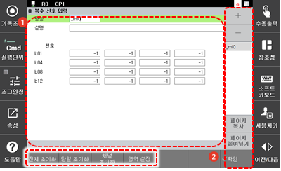
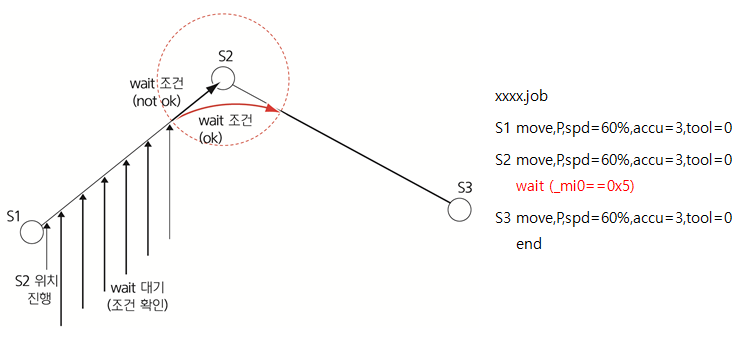

# 7.3.2.11    복수 신호 입력

입력 신호\(최대 16개\)를 하나의 그룹으로 생성하여 각각의 신호 입력으로 데이터를 얻을 수 있습니다.

데이터는 바이너리 포맷으로 입력의 on 또는 off에 따라 결정됩니다. 예를 들어, 다음 화면에서 di41과 di43이 on이고 이외의 모든 신호가 off일 경우 데이터는 0101 \(십진수 5\)입니다.

1. \[2: 제어 파라미터 &gt; 2: 입출력 신호 설정 &gt; 8: 복수 신호 입력\] 메뉴를 터치하십시오.
2. 입력 신호 그룹의 이름과 신호를 설정하십시오.

<table>
  <thead>
    <tr>
      <th style="text-align:left">번호</th>
      <th style="text-align:left">설명</th>
    </tr>
  </thead>
  <tbody>
    <tr>
      <td style="text-align:left">
        
      </td>
      <td style="text-align:left">
        
입력 신호 그룹 목록에서
          선택한 그룹의 상세 정보입니다.
          그룹 이름과 설명, 신호를
          설정할 수 있습니다.

        <ul>
          <li>[ALL 초기화]/[ONE 초기화]: 모든
            신호 또는 선택된 신호의
            설정값을 -1로 초기화합니다.</li>
          <li>[채널 초기화]: 설정된
            신호의 입력 채널을 초기화합니다(0
            ~ 9: 디지털 신호).</li>
          <li>[범위 지정]: 시작 신호와
            종료 신호를 지정하여
            신호를 빠르게 설정합니다.</li>
        </ul>
      </td>
    </tr>
    <tr>
      <td style="text-align:left">
        
      </td>
      <td style="text-align:left">
        <ul>
          <li>[확인]: 변경 내용을 저장합니다.</li>
          <li>[+]/[-]: 새로운 입력 신호 그룹을
            추가하거나 입력 신호
            그룹을 삭제합니다.</li>
          <li>입력 신호 그룹 목록입니다.
            그룹 이름을 선택하면
            상세 정보를 확인 및 편집할
            수 있습니다.</li>
          <li>[페이지 복사]/[페이지
            붙여넣기]: 입력 신호 그룹
            정보를 복사하여 다른
            그룹에 붙여 넣습니다.
             목록에서 복사할 그룹의
            이름을 선택하고 [페이지
            복사] 버튼을 터치한 후
            값을 적용할 그룹의 이름을
            선택하고 [페이지 붙여넣기]
            버튼을 터치하십시오.</li>
        </ul>
      </td>
    </tr>
  </tbody>
</table>

예를 들어, 위의 화면의 설정과 같이 구성된 작업 프로그램이 실행되면 다음과 같이 동작합니다.

S1에서 S2로 출발한 후 wait 명령문을 실행합니다. S2의 accuracy ok가 되기 이전에 wait 조건이 만족하면 빨간색 경로로 로봇이 이동하지만 그렇지 않는 경우 S2 위치에서 wait 조건이 만족할 때까지 계속 대기합니다.

