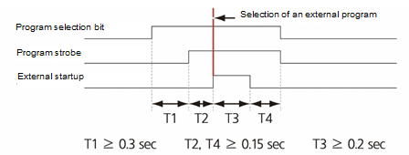
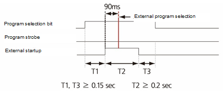
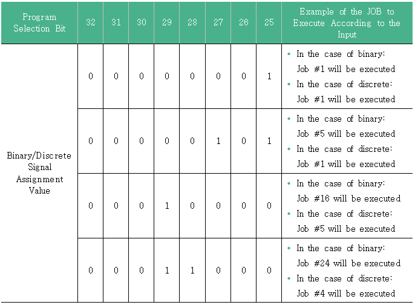

# 7.3.2.5 Input Signal Setting Information

#### Remote mode

When the mode switch of the teach pendant is selected to remote \(\), the corresponding signal should be turned on for the remote mode to be selected. If the corresponding signal is turned off, the internal mode will be selected. In general, if the mode switch of the teach pendant is selected to be remote \(\), the user wants to select the remote mode, which is why the basic value is set to 254, and the corresponding signal will be designated as negative logic in the input signal attribute.

#### Manual \(Teach\) mode

While the remote mode is selected, if the corresponding signal is turned on, you will be in a state in which the robot will be operated manually in remote mode. However, in general, there is no case of operating the robot in this state, and this mode is rarely used. 

#### Auto \(Playback\) mode 

While the remote mode is selected, if the corresponding signal is turned on, you will be in a state in which the robot will be operated automatically in remote mode. However, in general, if the mode switch of the teach pendant is selected to remote \(\), the user wants to operate the robot automatically in remote mode, which is why the basic value is set to 255, and the corresponding signal will be designated as negative logic in the signal attribute.

#### External start

This is used to start the robot in remote auto mode.

#### External stop 

This is used to stop the robot in remote auto mode.

#### Selection of an external program 

When the robot is externally started up, the timing of reading the program selection bit and determining it as an external program depends on whether to use the strobe signal.

* When the program strobe signal use is set as enable: If the program strobe signal is on while there is an external startup input, the program selection bit will be read, and the read value will be determined as the program number.

* When the program strobe signal use is set as disable: After there is an external startup input, the program selection bit will be read, and if this value does not change for 90 ms, it will be determined as the program number.

#### 

#### Program selection bit and binary/discrete \(off ?†’ binary\)

The program selection bit is a combination of signals to select a program to execute when an external start signal is inputted. It is applied only when a step is pointed in Header or in the End currently in the TP. When a program is being executed, the program will be executed to the end.

Binary/Discrete signal is an option that determines the interpretation of the program selection bit, and if it is 0, it will be recognized as binary, and if it is 1, it will be recognized as discrete.

For example, if the program selection bit is set as follows, an example of JOB to execute according to the input is as follows.

#### 

#### External reset

This function is used to perform the same operation as executing the R0 step counter reset function from the teach pendant by an external signal. When the robot is starting up, this function will not operate. If this function operates normally, the execution position will move to the beginning of the program, and the occurrence status of various errors or warnings will be cleared. Refer to ???[8.2 R0 for Resetting the Step Counter](../../../8-r-code/2-r0.md)??? for information on this function.

#### 

#### Low speed command

This function is used to limit the robot??™s moving speed to within the safe speed \(250 mm/s\) by an external signal.

#### Collision sensor

This function is used to detect the collision of the robot and stop the robot. In conjunction with the settings in the \[System&gt; 1: User Environment&gt; 6: Collision Sensor\] menu, conditions and signal logic for stopping the robot will be determined.

#### Error/Warning signal clearing

This function is used to clear the occurrence status of various errors and warnings by an external signal. 

#### 

#### Joystick mode

This function is used to manually jog the robot. It is generally used in LCD macro inspection equipment. Refer to a separate function manual for using the function.

#### Door switch

This function is used to stop the robot in movement when the door of the safety fence is opened.

#### Screen saver deactivation

If the teach pendant is not operated, the teach pendant will switch to the screen saver state when the screen off time set in the \[Menu&gt; 11: Teach Pendant Option\] menu has elapsed. This function is used to turn on the screen of the teach pendant by an external signal.

#### External motor on

This function is used to turn on the motor from an external operation panel.

#### External motor off

This function is used to turn off the motor from an external operation panel.

