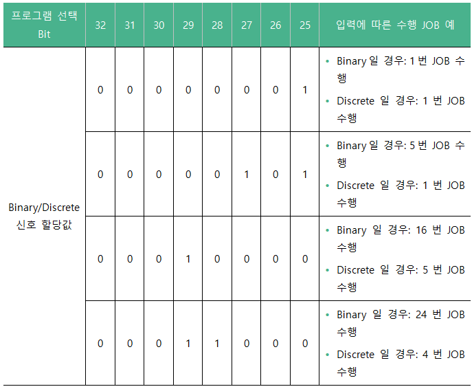

# 7.3.2.5 입력 신호 설정 정보

* 원격\(Remote\) 모드

티치 펜던트의 모드 스위치가 원격\(\)으로 선택된 상태에서 원격 모드로 선택되기 위해서는 해당 신호가 on 되어야 합니다. 해당 신호가 off되면 내부 모드로 선택됩니다. 일반적으로 티치 펜던트의 모드 스위치를 원격\(\)으로 선택하면 사용자는 원격 모드로 선택되기를 원하기 때문에 기본값은 254로 지정하였고 입력 신호 속성에 해당 신호는 부논리로 지정됩니다.

* 수동\(Teach\) 모드

원격 모드로 선택된 상태에서 해당 신호가 on되면 원격에서 수동으로 로봇을 조작하는 상태가 됩니다. 그런데 일반적으로 이 상태에서 로봇을 조작하는 경우는 없으므로 거의 사용하지 않습니다.

* 자동\(Playback\) 모드

원격 모드로 선택된 상태에서 해당 신호가 on되면 원격에서 자동으로 로봇을 조작하는 상태가 됩니다. 그런데 일반적으로 사용자는 티치펜던트의 모드 스위치를 원격\(\)으로 선택하면 원격에서 자동으로 로봇을 조작하기를 원하기 때문에 기본값은 255로 지정하였고 신호 속성에 해당 신호는 부논리로 지정됩니다.

* 외부 기동

원격 자동 모드에서 로봇을 기동\(start\)하기 위해 사용합니다.

* 외부 정지

원격 자동 모드에서 로봇을 정지\(stop\)하기 위해 사용합니다.

* 외부 프로그램 선택

외부에서 기동 동작 시 프로그램 선택 Bit를 읽어 외부 프로그램으로 확정하는 시점은 프로그램 스트로브\(Strobe\) 신호의 사용 여부에 따라 달라집니다.

* 프로그램 스트로브 신호 사용이 유효인 경우: 외부 기동 입력 시 프로그램 스트포브 신호가 On이면 프로그램 선택 Bit를 읽고, 이 값을 프로그램 번호로 확정합니다.  

* 프로그램 스트로브 신호 사용이 무효인 경우: 외부 기동 입력 후 프로그램 선택 Bit를 읽고, 이 값이 90 ms 동안 변경되지 않는 경우에 프로그램 번호로 확정합니다.

* 프로그램 선택 Bit와 Binary/Discrete \(OFF→Binary\)

프로그램 선택Bit는 외부 기동 신호가 입력되었을 때, 실행할 프로그램을 선택하기 위한 신호 조합입니다. 현재 TP에서 프로그램 HEADER 혹은 END에 커서가 있을 때에만 적용되며, 프로그램 수행 중에는 수행 중인 프로그램을 끝까지 수행하게 됩니다. Binary/Discrete 신호는 프로그램 선택 Bit의 해석을 결정해주는 옵션이며, 0인 경우 Binary로 인식하고, 1인 경우에는 Discrete로 인식합니다. 예를 들어, 프로그램 선택 Bit가 다음과 같이 설정된 경우, 입력에 따른 수행 JOB 예는 다음과 같습니다.

* 외부 RESET

외부 신호에 의해 티치 펜던트에서 R0 스텝 카운터 리셋 기능을 실행한 것과 동일하게 동작하기 위해 사용합니다. 로봇이 기동 중인 경우에는 이 기능이 동작하지 않으며, 이 기능이 정상적으로 동작하면 프로그램의 처음으로 실행 위치를 이동하고 각종 에러나 경고의 발생 상태를 클리어합니다. 이 기능에 대한 내용은 “[8.2 R0 스텝 카운터 리셋](../../../r-code/r0.md)”을 참조하십시오.

* 저속 지령

외부 신호에 의해 로봇의 이동 속도를 안전 속도\(250mm/s\) 이내로 제한하기 위해 사용합니다.

* 충돌 센서

로봇의 충돌을 검지하고 로봇을 정지하기 위해 사용합니다. \[시스템 &gt; 1: 사용자 환경 &gt; 6: 충돌센서\] 메뉴의 설정과 연계하여 로봇을 정지할 때 조건과 신호의 논리가 결정됩니다.

* 에러/경보 신호 클리어

외부 신호에 의해 각종 에러나 경고의 발생 상태를 클리어합니다.

* 조이스틱 모드

로봇을 수동으로 조그하기 위해 사용합니다. 일반적으로 LCD 매크로 검사 장비에서 사용되며 사용을 위해서는 별도의 기능 설명서를 참고하시기 바랍니다.

* 도어 스위치

안전 펜스의 도어가 개방되었을 때 이동 중인 로봇을 정지하기 위해 사용합니다.

* 화면보호 해제

티치 펜던트를 조작하지 않으면 \[메뉴 &gt; 11: 티치 펜던트 옵션\] 메뉴에서 설정한 화면꺼짐 시간이 경과되면 티치 펜던트가 화면보호 상태로 전환됩니다. 외부 신호에 의해 티치 펜던트의 화면을 켜기 위해 사용합니다.

* 외부 모터 on

외부 조작 패널에서 모터 on을 수행하기 위해 사용합니다.

* 외부 모터 off

외부 조작 패널에서 모터 off를 수행하기 위해 사용합니다.

