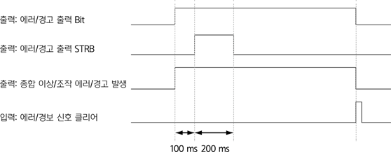

# 7.3.2.7 출력 신호 설정 정보

* 원격\(Remote\) 모드

티치 펜던트의 모드 스위치가 원격\(\)으로 선택된 상태로 입력 신호 할당에서 원격 모드에 설정된 신호가 on으로 입력되었을 때 비로소 원격 모드 상태가 됩니다. 이 상태를 외부로 출력하고자 할 때 사용합니다.

* 수동\(Teach\) 모드

제어기의 조작 모드가 수동 모드인 상태를 외부로 출력하고자 할 때 사용합니다.

* 자동\(Playback\) 모드

제어기의 조작 모드가 자동 모드인 상태를 외부로 출력하고자 할 때 사용합니다.

* 모터 ON

MOTOR ON 입력에 의해 각각의 모터에 전원이 공급되고 구동할 준비가 되었을 때 이 상태를 외부로 출력하고자 할 때 사용합니다.

* 로봇 준비 OK

현재 제어기의 상태가 \[설정 &gt; 2: 제어 파라미터 &gt; 4: 로봇 준비 조건\] 메뉴에서 설정된 조건이 모두 만족할 때 이 상태를 외부로 출력하고자 할 때 사용합니다.

* 기동 중

수동 모드에서 스텝 전후진 동작이나 자동 모드에서 기동 입력에 의해 로봇이 기동할 때 이 상태를 외부로 출력하고자 할 때 사용합니다.

* 로봇 동작 중\(Moving\)

로봇이 이동 중일 때 이 상태를 외부로 출력하고자 할 때 사용합니다.

* 일시 정지 중\(Hold\)

기동 중 신호의 출력과 상반되게 로봇이 정지 중일 때 이 상태를 외부로 출력하고자 할 때 사용합니다.

* 비상 정지 중

티치 펜던트 또는 제어기 전면에 장착된 비상 정지 버튼이 입력된 상태를 외부로 출력하고자 할 때 사용합니다.

* 비상 정지 중\(외부\)

시스템 보드와 연결된 외부 비상 정지가 입력된 상태를 외부로 출력하고자 할 때 사용합니다

* 저속 모드 중

입력 신호 할당에서 저속 지령에 설정된 신호가 on인 경우나 수동 모드에서는 로봇이 안전 속도에서 동작하며 이 상태를 외부로 출력하고자 할 때 사용합니다.

* 프로그램 END

작업 프로그램에서 사이클 END가 수행되면 이 상태를 외부로 출력하고자 할 때 사용합니다.

* 종합 이상

제어기에서 발생되는 에러는 시스템 오류에 의해 발생하는 에러와 사용자의 조작 실수에 의해 발생하는 에러로 구분됩니다. 시스템 오류에 의해 에러가 발생할 때 이 상태를 외부로 출력하고자 할 때 사용합니다. 시스템 오류에 의해 발생하는 에러는 1 ~ 999와 2000 ~ 7999 이내에 해당합니다.

* 조작 에러

제어기에서 발생되는 에러는 시스템 오류에 의해 발생하는 에러와 사용자의 조작 실수에 의해 발생하는 에러로 구분됩니다. 사용자의 조작 실수에 의해 에러가 발생할 때 이 상태를 외부로 출력하고자 할 때 사용합니다. 참고로 시스템 오류에 의해 발생하는 에러는 1 ~ 999와 2000 ~ 7999 이내에 해당합니다.

* 경고 발생

제어기에서 경고가 발생하면 이 상태를 외부로 출력하고자 할 때 사용합니다.

* 충돌 센서

입력 신호 할당에 설정된 충돌 센서 입력이 on되어 로봇에 충돌이 발생되었을 때 이 상태를 외부로 출력하고자 할 때 사용합니다.

* 스텝 SET 경보

자동 모드에서 현재 선택된 커서의 위치가 이전에 실행했던 위치와 다른 경우는 위험할 수 있으므로 이 상태를 외부로 출력하고자 할 때 사용합니다.

* 인터록 이상

작업 프로그램의 WAIT 명령문에서 대기한 시간이 \[시스템 &gt; 2: 제어 파리미터 &gt; 1: 제어 환경 설정\] 메뉴의 \[인터록 이상 시간\] 옵션에 설정된 시간을 초과하면 이 상태를 외부로 출력하고자 할 때 사용합니다.

* 에러/경고 출력 Bit, 에러/경고 출력 선택, 에러/경고 출력 STRB

에러/경고 출력 Bit, 에러/경고 출력 STRB, 종합 이상, 조작 에러, 경고 발생 신호는 다음의 시퀀스를 참조하십시오.

* 외부 RESET ACK

입력 신호 할당에 설정된 외부 RESET 신호가 on되면 이 상태를 외부로 출력하고자 할 때 사용합니다. 이 신호는 200ms동안 on된 후 자동으로 off됩니다.

* 프로그램 에코 Bit

입력 신호 할당에 설정된 프로그램 선택 Bit에 의해 프로그램이 선택되었을 때 선택된 프로그램 번호를 외부로 출력하고자 할 때 사용합니다.

* 프로그램 ACK

원격 모드에서 외부 기동 입력에 의해 로봇이 기동할 때 이 상태를 외부로 출력하고자 할 때 사용합니다. 이 신호는 200ms동안 on된 후 자동으로 off됩니다.

* 아크 용접 이상

아크 용접과 관련하여 에러가 발생한 경우에 이 상태를 외부로 출력하고자 할 때 사용합니다.

* 아크 용착 경보

아크 용접 중 용착이 발생한 경우에 이 상태를 외부로 출력하고자 할 때 사용합니다. 이 신호는 200ms동안 on된 후 자동으로 off됩니다.

* 로봇락 상태\(유효=ON\)

\[조건설정\]에서 로봇 Lock 설정 상태를 외부로 출력하고자 할 때 사용합니다.

* 필드버스 이상, 필드버스 IDLE

CC-LINK, 디바이스넷 등의 필드 버스 통신 보드를 사용할 때 통신의 상태를 외부로 출력하고자 할 때 사용합니다.

* 배터리\(백업, 엔코더\) 전압저하

메인 보드에 장착된 SRAM 상태를 유지하기 위한 백업 배터리나 각각의 모터에 장착된 엔코더 값을 유지하기 위한 엔코더 배터리에 전압 저하가 발생한 상태를 외부로 출력하고자 할 때 사용합니다.

* 토크모니터링

로봇 6축에 인가되는 토크값을 외부로 출력하고자 할 때 사용합니다. 외부로 출력되는 토크값은 1/2 배율의 % 값입니다.

* 그리스 주유 알람

그리스 주유가 필요한 상태를 외부로 출력하고자 할 때 사용합니다.

* 평균 부하율 이상 알람

로봇이 작업 중 평균치 부하율을 초과하였는지 상태를 외부로 출력하고자 할 때 사용합니다.

