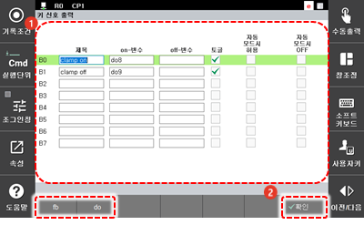

# 7.3.2.8 키 신호 출력

원하는 출력 신호를 키 신호 출력 기능 영역의 버튼에 할당하여 간단히 출력 신호를 켜거나 끄도록 설정할 수 있습니다.

1. \[2: 제어 파라미터 &gt; 2: 입출력 신호 설정 &gt; 5: 키 신호 출력\] 메뉴를 터치하십시오.
2. 버튼에 표시할 기능 이름과 옵션을 설정한 후 \[**확인**\] 버튼을 터치하십시오.

* \[fb\] / \[do\]: 숫자와 소수점만으로 신호 출력 변수값을 간단히 입력합니다.

예를 들어, 2.9를 입력한 후 <<b>ENTER</b>> 키를 누르십시오. fb2.do9로 변환되어 나타납니다. 소수점 없이 9를 입력하고 <<b>ENTER</b>> 키를 누르면 do9로 변환됩니다.


Hi6 티치 펜던트의 사용자키 영역에서도 원하는 출력 신호를 버튼에 등록할 수 있습니다. 자세한 내용은 “[2.6.2.1 키 신호 출력 기능 영역](../../../2-operation/6-user-key/2-button-registration/1-key-signal-output.md)”를 참조하십시오.


