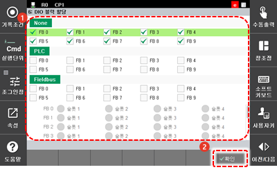

# 7.3.2.9 DIO 블록 할당

제어기의 범용 입출력 신호를 사용하는 방법을 설정합니다. 사용 안함\(None\), PLC, Fieldbus에 연결하여 사용할 수 있습니다.

1.	\[2: 제어 파라미터 &gt; 2: 입출력 신호 설정 &gt; 6: DIO 블록 할당\] 메뉴를 터치하십시오.

2.	선택된 FB 주소의 DIO 블록을 연결 설정한 후 \[**확인**\] 버튼을 터치하십시오.

* \[None\]: 선택된 FB 주소의 DIO 블록을 할당하지 않습니다. 제어기의 초기 설정값으로 아무것도 선택하지 않을 경우 None으로 설정됩니다.
* \[PLC\]: 선택된 FB 주소의 DIO 블록을 PLC로 연결하여 사용합니다. PLC 동작은 MULTIPROG 프로그램을 이용합니다.
* \[Fieldbus\]: 선택된 FB 주소의 DIO 블록을 PCI 통신 카드\(Fieldbus\)로 연결하여 사용합니다. DIO 블록을 PCI 통신 카드로 연결할 경우 PCI 보드 선택창이 활성화됩니다.


\[PLC\]와 \[Fieldbus\]를 동시에 사용하는 경우. Multiprog 프로그램과 \[Fieldbus\]의 슬롯번호가 중복되지 않도록 유의하여 주시기 바랍니다.


