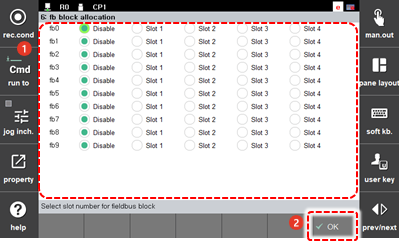

# 7.3.2.9 FB Block Allocation

You can set the method of using the controller’s general input/output signals. This function can be used through connection to None, PLC, or Fieldbus item.

1.	Touch the \[2: Control Parameter &gt; 2: Input/Output Signal Setting &gt; 6: FB Block Allocation\] menu.

2.	Set the connection with the DIO block of the selected FB address, and then touch the \[OK\] button.

    

* \[Fieldbus\]: The DIO block of the selected FB address will be connected to the PCI communication board \(Fieldbus\) for the use. 

