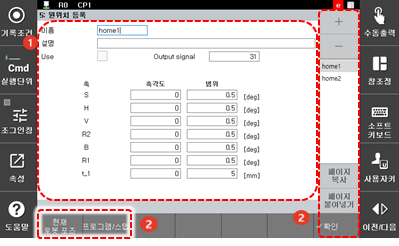

# 7.3.5 원위치 등록

로봇의 임의 자세를 원위치로 등록하여 로봇이 이 위치에 들어왔을 때 원위치 신호를 출력 신호란에 출력할 수 있습니다. 원위치는 축별 자세로 지정하고 8 개까지 등록하여 사용할 수 있으며 축별 마진을 추가로 설정할 수 있습니다.

1. \[2: 제어 파라미터 &gt; 5: 원위치 등록\] 메뉴를 터치하십시오.
2. 원위치 탭을 선택하고 사용 여부와 출력 신호, 축각도와 범위를 설정하십시오.

<table>
  <thead>
    <tr>
      <th style="text-align:left">번호</th>
      <th style="text-align:left">설명</th>
    </tr>
  </thead>
  <tbody>
    <tr>
      <td style="text-align:left">
        
      </td>
      <td style="text-align:left">
        
탭에서 선택한 원위치의
          상세 정보입니다. 사용
          여부와 출력 신호, 축각도와
          범위, 설명을 설정할 수
          있습니다.

        <ul>
          <li>[사용 여부]: 사용 여부를
            설정합니다.</li>
          <li>[출력 신호]: 출력 신호
            번호를 입력합니다.</li>
          <li>[축각도]/[범위]: 원위치에서
            로봇의 축각도와 범위를
            입력합니다.</li>
          <li>범위가 0으로 설정된 경우,
            해당 축에 대해서는 원위치
            검사를 수행하지 않습니다.</li>
          <li>범위는 원위치 포인트의
            + 방향과 - 방향의 범위로
            사용합니다. 예를 들어,
            범위를 0.5로 설정하면 원위치
            신호의 출력 범위는 1이
            됩니다.</li>
        </ul>
      </td>
    </tr>
    <tr>
      <td style="text-align:left">
        
      </td>
      <td style="text-align:left">
        <ul>
          <li>[**확인**]: 변경 내용을 저장합니다.</li>
          <li>[현재 로봇 포즈]: 현재
            로봇 자세의 축각도와
            범위가 자동으로 입력됩니다.</li>
          <li>[프로그램/스텝]: 프로그램과
            스텝 번호를 입력하면
            해당 스텝의 축각도와
            범위가 자동으로 입력됩니다.</li>
        </ul>
      </td>
    </tr>
  </tbody>
</table>

