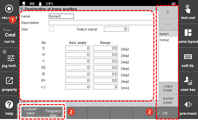

# 7.3.5 Home Position Registration

By registering the robot’s arbitrary posture as the home position, you can allow the home position signal to be outputted to the output signal field when the robot enters this position. The home position can be designated based on the posture of each axis, and up to eight postures can be registered and used, and the margin for each axis can be additionally set.

1.	Touch the \[2: Control Parameter &gt; 5: Registration of Home Position\] menu.

2.	Select the home position tab, and then set the use, output signal, axis angle, and range.

<table>
  <thead>
    <tr>
      <th style="text-align:left">No.</th>
      <th style="text-align:left">Description</th>
    </tr>
  </thead>
  <tbody>
    <tr>
      <td style="text-align:left">
        
      </td>
      <td style="text-align:left">
        
Detailed information on the home position selected in the tab. You can
          set the use, output signal, axis angle and range, and description.

        <ul>
          <li>[Use]: You can set whether to use.</li>
          <li>[Output Signal]: You can input the output signal number.</li>
          <li>[Axis Angle]/[Range]: You can input the axis angle and range of the robot
            at the home position.</li>
          <li>If the range is set to 0, home position inspection will not be performed
            for the axis.</li>
          <li>The range refers to a range that covers the + direction and - direction
            of the home point. For example, if the range is set to 0.5, the output
            range of the home position signal will be 1.</li>
        </ul>
      </td>
    </tr>
    <tr>
      <td style="text-align:left">
        
      </td>
      <td style="text-align:left">
        <ul>
          <li><b>[OK]</b>: You can save the changes.</li>
          <li><b>[Current Robot Pose]</b>: The axis angle and range of the current robot
            posture will be automatically inputted.</li>
          <li><b>[Program/Step]</b>: If you input the program and step number, the axis
            angle and range of the relevant step will be automatically inputted.</li>
        </ul>
      </td>
    </tr>
  </tbody>
</table>

