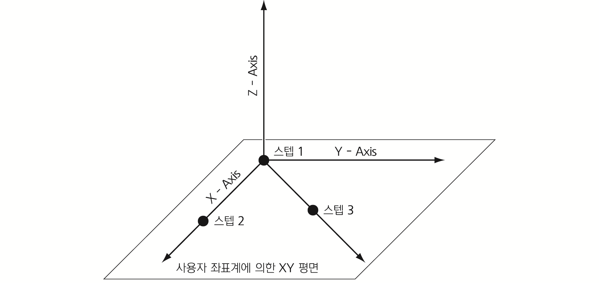
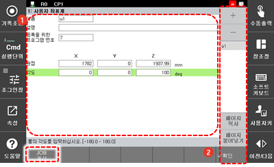

# 7.3.6.1 사용자 좌표계

사용자 좌표계는 사용자\(User\)가 지정하는 위치에 설정하는 좌표계입니다. 사용자 좌표계를 사용하기 위해 먼저 사용자 좌표계 정의를 위한 3개의 기준 스텝을 티칭한 후 티칭된 프로그램 번호와 사용자 좌표계 번호를 지정하여 사용자 좌표계를 등록합니다.

다음 절차에 따라 3개의 기준 스텝을 티칭하십시오.

1. 사용자 좌표계의 원점 정의: 임의의 한 점을 티칭하십시오.
2. 사용자 좌표계의 X축 정의: 가능한 한 원점과의 거리가 200 ㎜ 이상 떨어진 지점의 X축 선상에 임의의 한 점을 티칭하십시오.
3. 사용자 좌표계의 XY 평면 정의\(Y축과 Z축 방향 결정\): 가능한 한 원점과의 거리가 200 ㎜ 이상 떨어진 지점의 X축과 Y축으로 이루어지는 평면상에 임의의 한 점을 티칭하십시오.


* 사용자 좌표계 설정용 프로그램을 티칭할 때 TCP \(Tool Center Point\)는 정확한 값으로 설정되어 있어야 합니다. 현재 선택된 툴의 툴 데이터가 정확한 값으로 입력되었는지 확인하십시오.
* 사용자 좌표계는 총 10개까지 등록할 수 있습니다.



좌표계 정의를 위한 기준점 기록 시 주의 사항은 다음과 같습니다.

* 기준 3점이 동일 직선상에 존재하지 않아야 합니다.
* 기준 3점 간의 거리가 지나치게 가깝지 않아야 합니다.
* 사용자 좌표계의 XY 평면을 정의한 이후의 이후의 스텝은 좌표계 등록에 아무런 영향을 미치지 않습니다.


티칭된 프로그램 번호와 사용자 좌표계 번호를 지정하여 사용자 좌표계를 등록하는 방법은 다음과 같습니다.

1. \[2: 제어 파라미터 &gt; 6: 좌표계 등록 &gt; 1: 사용자 좌표계\] 메뉴를 터치하십시오.
2. 사용자 좌표계 이름과 프로그램 번호, 축별 원점과의 거리 및 각도를 설정하십시오.

<table>
  <thead>
    <tr>
      <th style="text-align:left">번호</th>
      <th style="text-align:left">설명</th>
    </tr>
  </thead>
  <tbody>
    <tr>
      <td style="text-align:left">
        
      </td>
      <td style="text-align:left">사용자 좌표계 목록에서
        선택한 좌표계의 상세
        정보입니다. 좌표계 이름과
        설명, 티칭된 프로그램
        번호, 축별 원점과의 거리
        및 각도를 설정할 수 있습니다.</td>
    </tr>
    <tr>
      <td style="text-align:left">
        
      </td>
      <td style="text-align:left">
        <ul>
          <li>[확인]: 변경 내용을 저장합니다.</li>
          <li>[+]/[-]: 새로운 사용자 좌표계를
            추가하거나 사용자 좌표계를
            삭제합니다.</li>
          <li>사용자 좌표계 목록입니다.
            좌표계 이름을 선택하면
            상세 정보를 확인 및 편집할
            수 있습니다.</li>
          <li>[페이지 복사]/[페이지
            붙여넣기]: 사용자 좌표계
            정보를 복사하여 다른
            좌표계에 붙여 넣습니다.
             목록에서 복사할 좌표계
            정보의 이름을 선택하고
            [페이지 복사] 버튼을 터치한
            후 값을 적용할 좌표계의
            이름을 선택하고 [페이지
            붙여넣기] 버튼을 터치하십시오.</li>
          <li>[JOB 계산]: 사용자 좌표계를
            정의하기 위해 티칭한
            프로그램을 기반으로
            사용자 좌표계를 계산합니다.
             [등록을 위한 프로그램
            번호] 옵션에 티칭한 프로그램의
            번호를 입력한 후 [JOB 계산]
            버튼을 터치하면 사용자
            좌표계의 원점과 각도가
            계산됩니다.</li>
        </ul>
      </td>
    </tr>
  </tbody>
</table>

