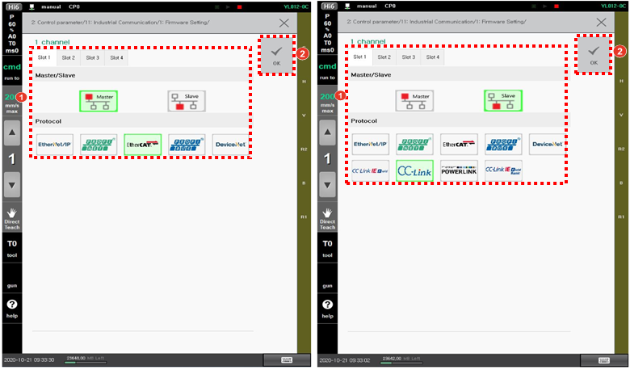

# 7.3.9.1 Firmware Setting

You can set the firmware to be used for the industrial communication.

1.	Touch the \[2: Control Parameter &gt; 11: Industrial Communication &gt; 1: Firmware Setting &gt; 1 Channel\] menu. Then, the firmware setting screen will appear.

2.	Select the desired tab and then set the communication method \(Master / Slave\) and protocol. After that, tap the \[OK\] button.


When the firmware setting is completed, the CONFIG files set in the slot \#1 - \#4 will be all deleted. When you want to change the communication firmware in the middle of using it, you should back up the existing CONFIG setting separately and use it after restoring it. 


3.	Turn off the power of the controller, and then turn it back on.


* When you perform the setting of the firmware to use it, the setting value will be applied to the system only after you turn off the power of the controller and then turn it back on.


