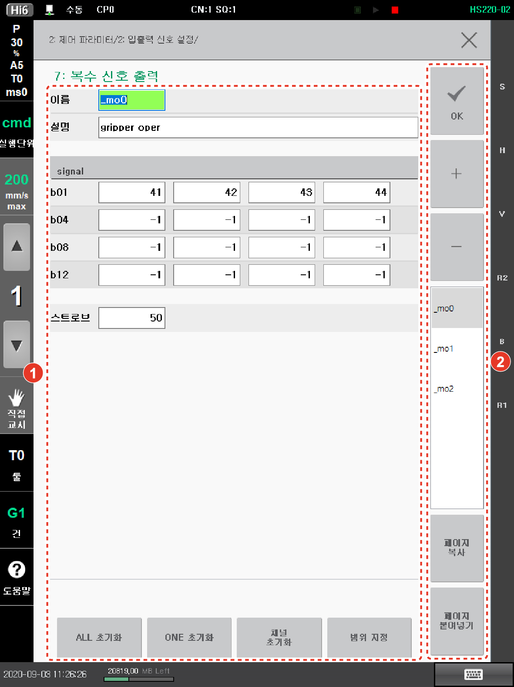
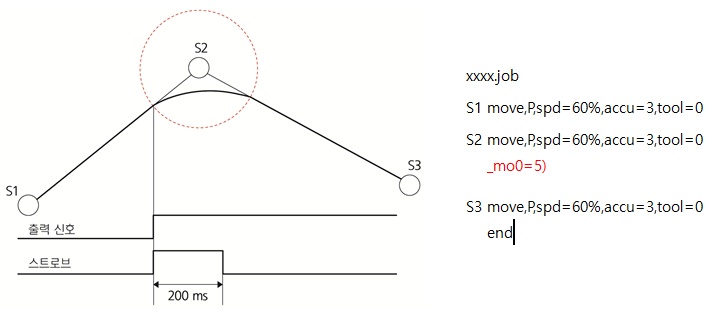

# 7.3.2.10    복수 신호 출력

출력 신호\(최대 16개\)를 하나의 그룹으로 생성하여 데이터를 각각의 신호로 출력할 수 있습니다.

데이터는 바이너리 포맷으로 출력의 on 또는 off를 결정합니다. 예를 들어, 다음 화면에서 do41과 do43을 출력하기 위한 데이터는 바이너리로 0101 \(십진수 5\)입니다.

1. \[2: 제어 파라미터 &gt; 2: 입출력 신호 설정 &gt; 7: 복수 신호 출력\] 메뉴를 터치하십시오.
2. 출력 신호 그룹의 이름과 신호, 스트로브를 설정하십시오.

<table>
  <thead>
    <tr>
      <th style="text-align:left">번호</th>
      <th style="text-align:left">설명</th>
    </tr>
  </thead>
  <tbody>
    <tr>
      <td style="text-align:left">
        
      </td>
      <td style="text-align:left">
        
출력 신호 그룹 목록에서
          선택한 그룹의 상세 정보입니다.
          그룹 이름과 설명, 신호
          및 스트로브를 설정할
          수 있습니다.

        <ul>
          <li>[ALL 초기화]/[ONE 초기화]: 모든
            신호 또는 선택된 신호의
            설정값을 -1로 초기화합니다.</li>
          <li>[채널 초기화]: 설정된
            신호의 출력 채널을 초기화합니다(0
            ~ 9: 디지털 신호).</li>
          <li>[범위 지정]: 시작 신호와
            종료 신호를 지정하여
            신호를 빠르게 설정합니다.</li>
        </ul>
      </td>
    </tr>
    <tr>
      <td style="text-align:left">
        
      </td>
      <td style="text-align:left">
        <ul>
          <li>[OK]: 변경 내용을 저장합니다.</li>
          <li>[+]/[-]: 새로운 출력 신호 그룹을
            추가하거나 출력 신호
            그룹을 삭제합니다.</li>
          <li>출력 신호 그룹 목록입니다.
            그룹 이름을 선택하면
            상세 정보를 확인 및 편집할
            수 있습니다.</li>
          <li>[페이지 복사]/[페이지
            붙여넣기]: 출력 신호 그룹
            정보를 복사하여 다른
            그룹에 붙여 넣습니다.</li>
        </ul>
        
목록에서 복사할 그룹의
          이름을 선택하고 [페이지
          복사] 버튼을 터치한 후
          값을 적용할 그룹의 이름을
          선택하고 [페이지 붙여넣기]
          버튼을 터치하십시오.

      </td>
    </tr>
  </tbody>
</table>

예를 들어, 위의 화면의 설정과 같이 구성된 작업 프로그램이 실행되면 다음과 같이 동작합니다.

S1에서 S2로 출발하여 S2의 accuracy ok가 되었을 때 지정된 그룹의 신호와 함께 스트로브 신호를 출력합니다. 200 ms 경과 후 스트로브 신호는 off 됩니다. \(스트로브 신호는 200 ms의 펄스 신호\)

