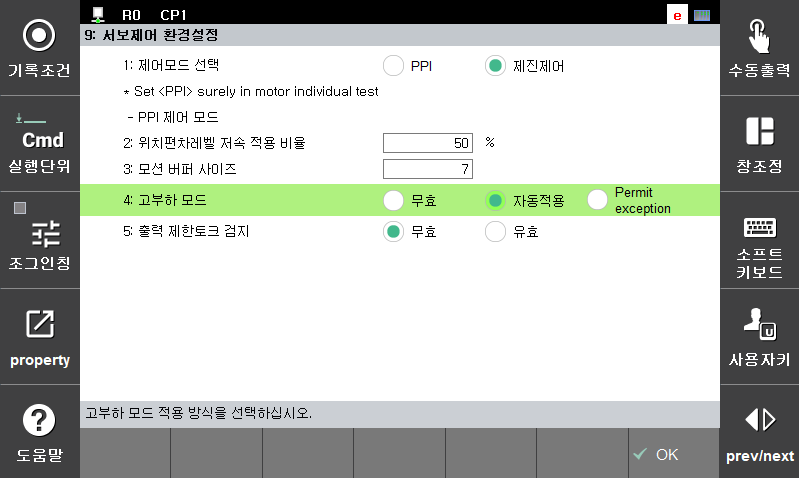
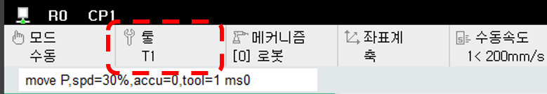

# 7.4.1.3 고부하 모드

로봇 기종별로 고부하모드 지원여부가 다를 수 있습니다. 통상적으로 가반하중이 100 Kg 이상인 중형로봇 이상에서 고부하 모드를 지원하고 있습니다.  고부하 모드를 지원하는 기종의 경우 [시스템] > [3. 로봇파라미터] > [33. 서보 파라미터] > [9. 서보제어 환경설정] 메뉴 에서 아래 그림에서와 같이  “4. 고부하 모드”에 대한 설정을 할 수 있습니다. 고부하 모드가 지원되는 기종의 경우 자동적용이 기본설정 값 입니다.

| 설정 값 | 동작 특성 |
| :--- | :--- |
|무효 | 툴 부하와 무관하게 일반 모드로 동작  - 모터 On 시 (W0051) 고부하 모드 '무효' 로 로봇의 조기고장 우려 경고 발생
|자동적용| 툴 부하가 정격부하 미만일 경우 일반 모드로 동작하고 정격을 초과하는 경우   고부하 모드로 전환 되며 로봇의 동작 속도 및 가감속이 낮아짐.
|예외허용| 툴 부하가 고부하모드 최대허용비율 미만인 경우 자동적용과 동일하게 동작   고부하 기준을 초과하는 경우 고부하 예외모드로 동작   -	모터 ON시 (W00177) 고부하 ‘예외허용’모드로 로봇의 조기고장 우려 경고

로봇에 현재 적용 된 툴의 부하에 따른 고부하 모드 적용 상태는 아리의 그림 에서와 같이 확인 할 수 있습니다. 

  : 일반 폰트

 : 굵은 폰트

 : 붉은 색 폰트


고부하 모드 허용 비율은 로봇 모델과 제어기 소프트웨어 버전에 따라 변경될 수 있습니다.


