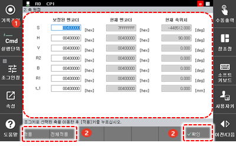

# 7.4.2 축 원점

각 축의 기구학적 원점 위치를 등록할 수 있습니다.

1. \[3: 로봇 파라미터 &gt; 2: 축 원점\] 메뉴를 터치하십시오.
2. 각 축의 기구학적 원점 위치를 설정하십시오.

<table>
  <thead>
    <tr>
      <th style="text-align:left">번호</th>
      <th style="text-align:left">설명</th>
    </tr>
  </thead>
  <tbody>
    <tr>
      <td style="text-align:left">
        
      </td>
      <td style="text-align:left">
        
각 축의 기구학적 원점
          위치의 상세 정보입니다.
          축의 엔코더와 위치를
          설정할 수 있습니다.

        <ul>
          <li>S축: 로봇과 주변 지그의
            설치 상황에 따라 S축 원점을
            변경합니다.</li>
          <li>R1축: 툴의 부착 방향에
            따라 R1축 원점을 변경합니다.</li>
          <li>H, V, R2, B축: 자동 캘리브레이션
            기능을 이용하여 자동으로
            설정할 수 있습니다.</li>
        </ul>
      </td>
    </tr>
    <tr>
      <td style="text-align:left">
        
      </td>
      <td style="text-align:left">
        <ul>
          <li>[확인]: 변경 내용을 저장합니다.</li>
          <li>[적용]: 선택된 축 정보에
            선택한 원점 위치를 적용합니다.</li>
          <li>[전체적용]: 모든 축 정보에
            선택한 원점 위치를 적용합니다.</li>
        </ul>
      </td>
    </tr>
  </tbody>
</table>


* 축 원점 설정은 로봇의 직교 동작 정확도에 영향을 미칩니다. 가능한 한 정확한 값으로 변경하십시오.
* 축 원점 설정이 변경되면 기존에 작성된 프로그램의 위치가 변경되므로 축 원점 설정은 반드시 초기 설치 단계에서만 실행하십시오.
* 엔코더 옵셋 설정이 변경되면 축 원점을 새로 설정해야 하므로 반드시 엔코더 옵셋 설정을 완료한 후에 축 원점을 설정하십시오.



공장 출하 시에는 각 축의 기구학적 원점 위치가 표준값\(0X400000\)으로 설정되어 있습니다.


