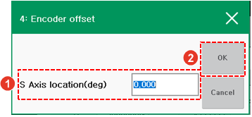

# 7.4.4.1 Encoder Offset Value Utilization

To continue using the existing program even after the current job program is backed up and the system is initialized \(\[Set up &gt; 5: Initialize&gt; 1: System Initialization\]\), the robot should maintain the reference position information that existed before initialization. If you record the encoder offset value, the previous position information of the robot can be retrieved.

After system initialization, directly input the encoder offset value as a hex value. It will be easy to input the value if you use the soft keyboard.

If the encoder offset value is recorded as the axis position value \(mm or degree\), you need to input the axis position value into the input window that will appear when you touch the \[Reset One\] button while pressing the &lt;Shift&gt; key.


The basic setting value in the axis position input window is the reference position value. If you save without inputting the axis position value, the current encoder position will be set as the origin position \(0X400000\).


