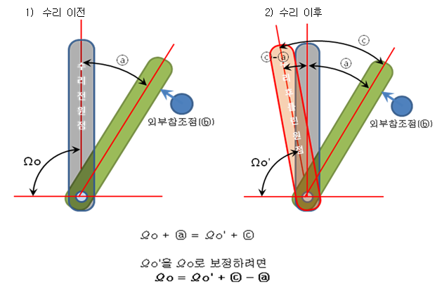
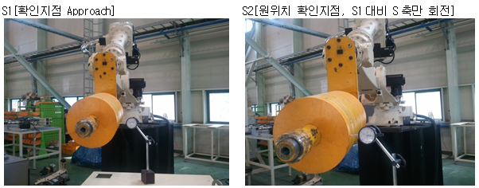
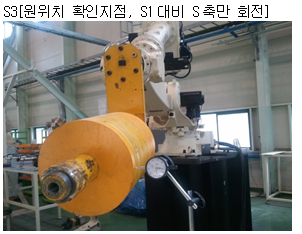
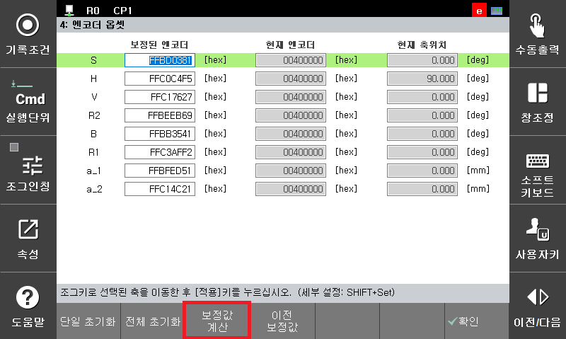
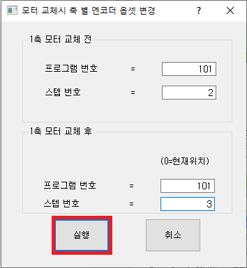
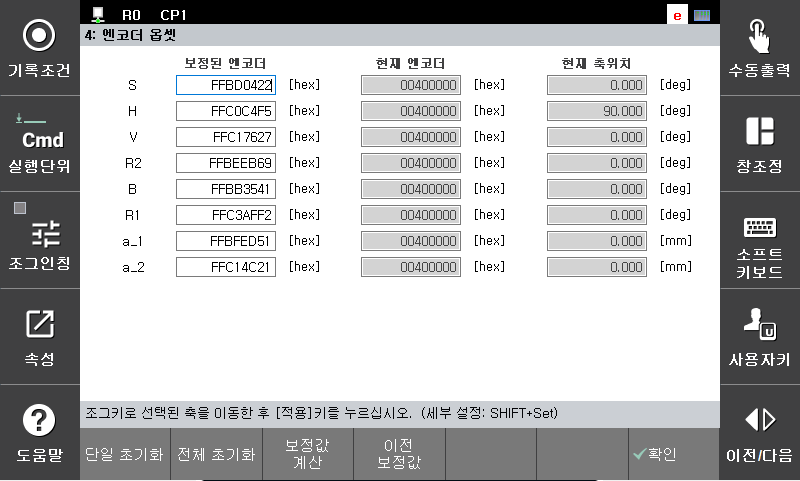

# 7.4.4.2 축별 원위치 복원

로봇 기구의 부품 고장(특히, 모터나 감속기)이 발생하여 해당 부품을 교체하는 경우 기존 티칭 프로그램을 재가동하기 위해서는 기존의 원점과 동일한 조건으로 엔코더를 보정하여야 합니다.   하지만 AS요원이 현장에서 상기의 조치를 수동으로 할 때는 다수의 시행착오를 통해 원점을 맞추는 경우가 발생하기도 하는데 이를 쉽게 조치하기 위한 전용 기능입니다.

※ 기구 수리 후 원위치 복원이란?

즉, 원위치 복원이란  
외부참조점(다이얼게이지)을 이용하여 부품 교체 후, 부정확하게 보정된 원점 Ωo'을  
ⓒ-ⓐ값으로 보상하여 정확한 원점인 Ωo로 복원하는 것.(티칭프로그램 재사용을 위해 필요)


외부참조점(ⓑ)의 위치가 부품 교체 전과 교체 후에 변경되면 안됩니다. 즉, 부품 교체 전과 교체 후 반드시 동일 위치여야 합니다.

 
 
<사용 예>  
하기에서는 S축의 모터를 교체한다는 가정하에 기능을 설명합니다.

1.	신규 프로그램(101.job)을 지정하고 단단히 고정된 툴의 한 지점과 JIG 혹은 주변장치에 근접하도록 S1[확인지점 Approach], S2[원위치 확인지점, S1대비 S축만 회전]을 티칭합니다.

2.	S축의 모터를 교체한 후, 교체전의 엔코더 보정 위치와 근접하게 S축을 수동 조작한 후 시스템/로봇 파라미터/엔코더 보정 화면에서 S축에 대해 엔코더 보정을 수행합니다.

3.	티칭된 프로그램(101.job)을 수동 조작하여 S1으로 이동하고, 그 후 S2로 이동하면서 기구 부품 교체전과 동일한 위치가 되었을 때 S3[원위치 확인지점, S1대비 S축만 회전]을 티칭합니다.  

4.	S축에 대한 엔코더 보정값을 자동 계산합니다.
    1) 시스템/로봇 파라미터/엔코더 보정 화면에 진입합니다.  
    2) S축으로 커서를 이동한 후, [F3:보정값계산]을 누릅니다.  
    

    3)	“S축 모터 교체 전”의 프로그램 번호는 101, 스텝 번호는 2로 설정하며
“S축 모터 교체 후”의 프로그램 번호는 101, 스텝 번호는 3으로 설정한 후,
[실행] 버튼을 누릅니다.  
(※ “S축 모터 교체 후”의 프로그램 또는 스텝 번호가 0이면 현재 로봇의 S축 위치로 엔코더 보정값을 계산합니다.)  
    

    4)	S축에 계산된 엔코더 보정값이 화면에 표시되며, [F7:확인]를 누르면 보정된 엔코더값이 반영됩니다.  
    

    5.	티칭된 프로그램(101.job)의 S2로 이동하였을 때, 모터 교체전과 동일한 위치인지 확인합니다.  
    