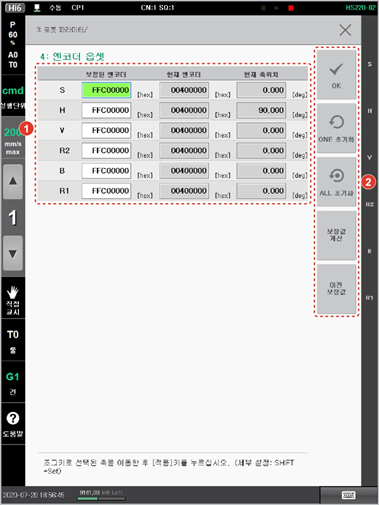

# 7.4.4 엔코더 옵셋

현재 엔코더의 위치를 엔코더의 원점 위치\(0X400000위치\)로 설정할 수 있습니다. 로봇 각 축의 기준 위치\(각 축의 스케일이 부착된 위치\)에서 엔코더의 원점을 결정합니다.

1. \[3: 로봇 파라미터 &gt; 4: 엔코더 옵셋\] 메뉴를 터치하십시오.
2. 각 축의 위치를 조정하여 엔코더 옵셋값을 설정하십시오. 엔코더 옵셋값은 헥사값\(Hexa값, 16진수\)으로 기록됩니다.

<table>
  <thead>
    <tr>
      <th style="text-align:left">번호</th>
      <th style="text-align:left">설명</th>
    </tr>
  </thead>
  <tbody>
    <tr>
      <td style="text-align:left">
        
      </td>
      <td style="text-align:left">각 축의 엔코더 옵셋값의
        상세 정보입니다. 축의
        보정된 엔코더 값과 현재
        엔코더 값, 현재 위치를
        설정할 수 있습니다.</td>
    </tr>
    <tr>
      <td style="text-align:left">
        
      </td>
      <td style="text-align:left">
        <ul>
          <li>[OK]: 변경 내용을 저장합니다.</li>
          <li>[ONE 초기화]/[ALL 초기화]: 선택된
            축 또는 모든 축의 엔코더
            옵셋값을 초기화합니다.</li>
          <li>[보정값 계산]: 선택한
            축의 엔코더 옵셋값을
            보정합니다.</li>
          <li>[이전 보정값]: 선택한
            축의 보정 전 엔코더 옵셋값을
            불러 옵니다.</li>
        </ul>
      </td>
    </tr>
  </tbody>
</table>


공장 출하 시 엔코더 옵셋값이 설정됩니다. 모터나 엔코더 교환 등 필요한 경우에만 엔코더 옵셋값을 재설정하십시오.


