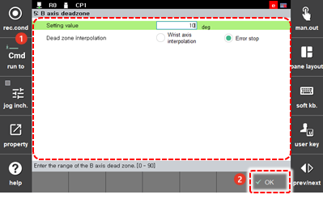

# 7.4.5 B-Axis Deadzone

Around 0 degree of the B-axis, the rotational center of the R1 axis and the rotational center axis of the R2 axis will be almost in parallel. When the TCP of the robot performs interpolation such as linear interpolation or circular interpolation, the wrist axis will move rapidly even in small movements.

Set the B-axis no-use area.

1.	Touch the \[3: Robot Parameter &gt; 5: B-axis Deadzone\] menu.

2.	After setting the angle for determining the no-use area and setting the interpolation handling mode, touch the \[OK\] button.

    

* \[Setting Value\]: You can input the angle for determining the B-axis no-use area.
* 
  \[Dead zone interpolation\]: When the trajectory of the robot has to pass through the B-axis no-use area in interpolation operation, you can perform the setting regarding the handling of errors and stopping of the robot. 

