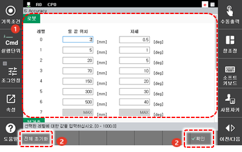

# 7.4.6 Accuracy

로봇의 목표 스텝 진행 시 스텝을 통과하는 정밀도인 Accuracy 레벨의 상세 조건을 설정합니다.

1. \[3: 로봇 파라미터 &gt; 6: Accuracy\] 메뉴를 터치하십시오.
2. Accuracy 레벨별 툴 끝 위치\(TCP\)와 자세를 설정하십시오.

<table>
  <thead>
    <tr>
      <th style="text-align:left">번호</th>
      <th style="text-align:left">설명</th>
    </tr>
  </thead>
  <tbody>
    <tr>
      <td style="text-align:left">
        
      </td>
      <td style="text-align:left">
        
Accuracy 레벨별 상세 정보입니다.
          Accuracy 레벨의 툴 끝 위치(TCP)와
          자세를 설정할 수 있습니다.

        <ul>
          <li>Accuracy 레벨은 0부터 7까지
            설정할 수 있으며 Accuracy 레벨은
            스텝 명령문 인수의 하나로
            기록됩니다.</li>
          <li>Accuracy 레벨 0 ~ 6: 각 레벨에 TCP
            거리 및 자세, 부가축의
            거리 및 각도를 입력합니다.
             LCD 로봇과 같이 직선 또는
            원호 보간을 지원하지
            않는 로봇의 경우에는
            부가축과 동일한 방법이
            적용됩니다.</li>
          <li>Accuracy 레벨 7: 제어기에서
            자동으로 값이 계산되어
            나타나므로 직접 입력하지
            않아도 됩니다.
             Accuracy 레벨 7을 사용하면 스텝
            거리의 1/2 조건을 만족하는
            최대의 코너링 경로가
            생성됩니다. LCD 핸드의
            진출입와 같이 로봇을
            최대한 부드럽고 빠르게
            동작시키고자 할 때 Accuracy
            레벨 7을 유용하게 사용할
            수 있습니다.</li>
        </ul>
      </td>
    </tr>
    <tr>
      <td style="text-align:left">
        
      </td>
      <td style="text-align:left">
        <ul>
          <li>[확인]: 변경 내용을 저장합니다.</li>
          <li>[전체 초기화]: 모든 Accuracy 레벨의
            TCP 거리와 자세를 초기화합니다.</li>
        </ul>
      </td>
    </tr>
  </tbody>
</table>


* “2.3 스텝”의 내용에 대한 이해를 바탕으로 Accuracy 레벨에 접근하면 더 쉽게 사용할 수 있습니다.
* 서보건과 이퀄라이저 리스건의 용접 스텝에서는 설정된 Accuracy 레벨에 관계없이 제어기에서 자동으로 제한합니다.


