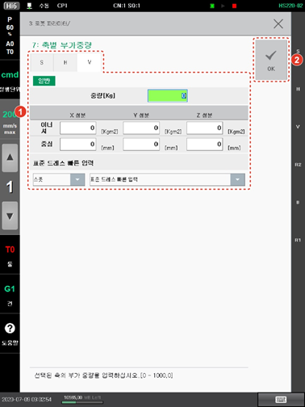

# 7.4.7 축별 부가중량

로봇의 기본 축에 장착된 트랜스포머나 배선용 지지대 등에 대한 정보를 등록합니다.

1.	\[3: 로봇 파라미터 &gt; 7: 축별 부가중량\] 메뉴를 터치하십시오.

2.	기본 축 탭을 선택하고 장착된 부가 중량 정보를 설정한 후 \[OK\] 버튼을 터치하십시오.


로봇에 트랜스포머나 배선용 지지대 등이 장착되어 부가 중량이 있을 경우에는 반드시 각 축의 부가 중량 정보를 등록하십시오. 부가 중량을 정확히 등록하지 않으면 툴 부하 추정 시 오차가 커질 수 있습니다.


