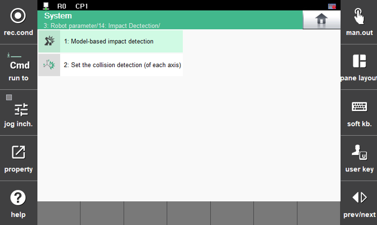

# 7.4.8 충돌검지

로봇 작업 중에 충돌이 발생하는 경우, 충돌의 피해를 최소화하기 위해 로봇 동작 중에 정상적으로 발생하는 토크와 현재 발생되고 있는 토크를 비교하여 비정상적인 토크가 발생하면 에러로 처리하는 기능을 충돌 검지라 합니다. 

Hi6 제어기에는 로봇이 비정상적인 조건에서 동작하게 되거나 이상 동작을 하게 될 때의 안전장치로서 기존에 있던 과전류, 과부하, 과속도 및 위치편차에러 검지 기능과 충돌검지 기능이 상호 보완적으로 작요앟여 로봇의 안정성을 높이는 역할을 합니다. 

\[3: 로봇 파라미터 &gt; 14: 충돌 검지\] 메뉴를 터치하십시오.


* 충돌검지 기능은 모터가 켜진 상태에서만 동작합니다.
* 반드시 정확한 툴/부가 중량 설정 or 부하추정을 실행한 후에 충돌검지 기능을 사용하십시오.
* 툴 중량 및 축별 부가 중량이 실제와 다를 경우, 오검지가 발생할 수 있습니다.
* 부하추정 및 센서기반/센서리스 힘 제어 기능 수행 시 충돌을 검지하지 않습니다.
* 로봇에 부착되지 않은 포지셔너, 정치건, 지그 등의 충돌은 검지할 수 없습니다.
* 특주형 로봇은 모델 기반의 충돌검지 기능을 지원하지 않습니다.



