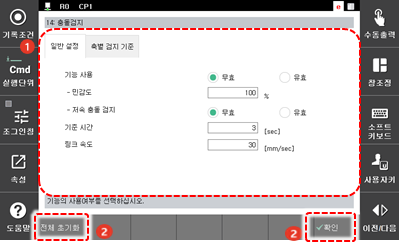

# 7.4.8 충돌검지

Hi6 제어기에는 로봇이 비정상적인 조건에서 동작하게 되거나 이상 동작을 하게 될 때의 안전 장치로 과전류, 과부하, 과속도, 위치 편차 에러 검지 기능과 충돌검지 기능이 있습니다. 이 두 기능이 상호 보완적으로 작용하여 로봇의 안전성을 높입니다.

Hi6 제어기에는 모델 기반의 충돌검지 기능을 기본으로 제공합니다. 모델 기반의 충돌검지 기능은 로봇이 동작 중에 정상적으로 발생해야 하는 토크와 실제 측정되는 토크의 차이를 로봇의 동역학 모델을 기반으로 계산하여 충돌을 검지합니다. 민감도를 설정하여 충돌에 대한 반응성을 조절할 수 있으며 로봇이 저속으로 움직일 때 발생하는 외부와의 접촉도 검지할 수 있습니다.

그러나 충돌검지 기능은 로봇 축에서의 충돌을 검지하므로 로봇에 충격이 전달되지 않는 경우에는 충돌이 검지되지 않습니다. 이외에 충돌검지 기능 사용 시 주의해야 할 사항은 다음과 같습니다.

* 충돌검지 기능은 모터가 켜진 상태에서만 동작합니다.
* 반드시 부하추정을 실행한 후에 충돌검지 기능을 사용하십시오.
* 툴 중량 및 축별 부가 중량이 실제와 다를 경우, 오검지가 발생할 수 있습니다.
* 부하추정 및 센서기반/센서리스 힘 제어 기능 수행 시 충돌을 검지하지 않습니다.
* 로봇에 부착되지 않은 포지셔너, 정치건, 지그 등의 충돌은 검지할 수 없습니다.
* 특주형 로봇은 모델 기반의 충돌검지 기능을 지원하지 않습니다.

충돌검지 기능을 설정하는 방법은 다음과 같습니다.

1. \[3: 로봇 파라미터 > 36: 고급기능 &gt; 14: 충돌검지\] 메뉴를 터치하십시오.
2. 충돌검지 기능의 사용 여부와 민감도 등을 설정하십시오.

<table>
  <thead>
    <tr>
      <th style="text-align:left">번호</th>
      <th style="text-align:left">설명</th>
    </tr>
  </thead>
  <tbody>
    <tr>
      <td style="text-align:left">
        
      </td>
      <td style="text-align:left">
        
충돌검지 기능의 사용
          옵션 정보입니다. 이 기능의
          사용 여부와 민감도, 저속
          충돌검지 기능 사용 여부를
          설정할 수 있습니다.

        <ul>
          <li>[기능 사용]: 충돌검지
            기능의 사용 여부를 설정합니다.</li>
          <li>[민감도]: 충돌검지 민감도를
            설정합니다. 값이 클수록
            충격에 민감하게 동작합니다.(기본
            설정값: 100%)</li>
          <li>[저속 충돌 검지]: 저속
            충돌검지 기능의 사용
            여부를 설정합니다.
            <ul>
              <li>[기준 시간]: 충돌로 판단하기
                위한 기준 시간을 설정합니다.
                기준 시간 동안 충격력이
                발생하면 충돌로 판단합니다.</li>
              <li>[링크 속도]: 저속으로
                판단하기 위한 기준 속도를
                설정합니다. 기준 링크
                속도 이하에서만 저속
                충돌을 검사합니다.</li>
            </ul>
          </li>
        </ul>
      </td>
    </tr>
    <tr>
      <td style="text-align:left">
        
      </td>
      <td style="text-align:left">
        <ul>
          <li>[확인]: 변경 내용을 저장합니다.</li>
          <li>[전체 초기화]: 모든 사용 옵션
            설정값을 초기화합니다.</li>
        </ul>
      </td>
    </tr>
  </tbody>
</table>

