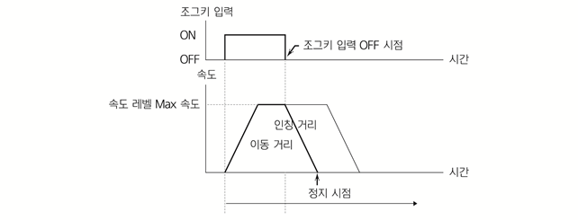

# 7.4.9.2 인칭 조그 조작

인칭 기능은 조그키 ONE PUSH 당 최대 이동 거리를 초과하여 움직이지 않게 하는 기능입니다.

인칭 거리에 도달한 이후에도 계속 조그키를 누르고 있다가 손을 떼면 로봇이 인칭 거리까지 감속하여 정지하고 움직이지 않습니다.

인칭 거리에 도달하기 전에 조그키에서 손을 뗀 경우에는 조그키에서 손을 뗀 시점부터 로봇이 감속하여 정지합니다. 이때는 일반 조그 모드와 동일합니다.


축 좌표계에서 속도 레벨 1은 엔코더 1 bit씩 이동하도록 고정되어 있습니다.


