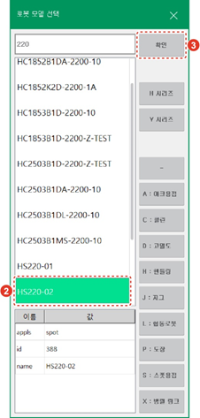
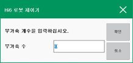
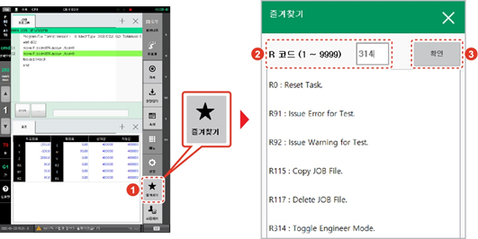
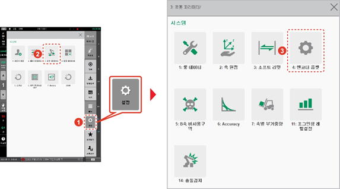
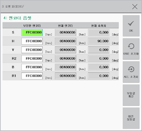

# 7.6.2 로봇 타입 선택

1.	\[5: 초기화 &gt; 2: 로봇타입 선택\] 메뉴를 터치하십시오. 또는 Hi6 티치 펜던트 화면 우측 상단의 \[메커니즘\] 버튼을 터치하십시오.

2.	로봇 모델 선택창에서 로봇을 선택한 후 \[확인\] 버튼을 터치하십시오.

* 로봇 모델 목록을 스크롤하여 모델명을 확인하거나 모델명을 직접 입력하여 검색할 수 있습니다.
* 로봇 용도 버튼을 터치하면 해당 용도에 속한 로봇만 목록에서 확인할 수 있습니다.
* 신규 로봇 모델을 선택하면 기계 파라미터 파일\(hi6\_porj.json\)이 초기 설정값으로 복원되고 각종 이력 파일도 초기화됩니다.
* 주행축이나 서보건과 같은 부가축이 포함된 시스템을 선택한 경우, 부가축의 개수를 설정하십시오. 부가축이 없이 로봇축만으로 구성된 시스템의 경우에는 0을 입력하면 됩니다.


* 로봇 본체와 제어기는 하나의 시스템으로 구성되어 출하됩니다. 이 때문에 로봇 제어기에는 시스템을 함께 구성하는 로봇의 구동 용량에 맞는 드라이브가 장착됩니다.
* 시스템을 초기화하여 재설정할 경우에는, 공장 출하 시에 초기값으로 설정된 로봇 모델을 반드시 확인하여 올바른 모델로 설정하십시오.


3.	Hi6 티치 펜던트 화면 우측 하단의 \[즐겨찾기\] 버튼을 터치한 후 즐겨찾기 창의 입력 영역에 314를 입력하고 \[확인\] 버튼을 터치하십시오.


* 엔지니어 모드\(Engineer Mode\)에서는 상태 표시줄에 엔지니어 모드 아이콘\( \)이 깜빡입니다.
* 엔지니어 모드에서 잘못 설정하면 로봇 시스템에 심각한 문제가 발생할 수 있으므로 주의하시기 바랍니다.


4.	Hi6 티치 펜던트 화면 우측 하단의 \[설정\] 버튼 &gt; \[3: 로봇 파라미터 &gt; 4: 엔코더 옵셋\] 메뉴를 터치하십시오.

5.	엔코더 옵셋 보정을 수행하십시오. 로봇 위치가 기준 자세가 아니더라도 모터를 켜기 위해서는 임시로 엔코더 옵셋을 설정해야 합니다.


* 엔코더 옵셋 설정은 통상적으로 로봇을 기준 자세로 이동한 상태에서 수행합니다.
* 시스템 초기화 시에는 로봇의 위치가 기준 자세가 아니어도 엔코더 옵셋 설정을 수행하십시오. 그렇지 않으면 모터가 켜지지 않아 로봇을 구동할 수 없습니다.


6.	제어기의 전원을 껐다가 켠 후 모터에 전원을 공급하십시오.

7.	수동 모드에서 저속으로 안전하게 로봇을 기준 자세로 움직인 후 5 ~ 6번 단계를 참조하여 다시 엔코더 옵셋 보정을 수행하십시오.

* 엔코더 옵셋 설정에서는 현재 엔코더의 위치가 0X400000으로\(16 진수\) 설정됩니다.
* 모터가 고장 나 교체할 경우 같은 위치에서 엔코더 옵셋 설정을 수행하면 기록된 프로그램을 동일하게 사용할 수 있습니다.

8.	티치 펜던트의 &lt;프로그램&gt; 키를 눌러 프로그램 9999번을 선택한 후 한 스텝을 기록하십시오. 로봇을 기준 위치로 간편하게 이동할 수 있습니다.


* 협동로봇 초기화에 대한 자세한 내용은 “협동로봇 안전 기능 설명서”를 참조하십시오.
* 시스템을 초기화하려면 고객지원팀에 문의하여 전문가에게 의뢰하십시오.
* 시스템을 초기화하면 제어 파라미터 파일, 기계 파라미터 파일을 포함한 모든 데이터와 프로그램이 삭제됩니다. 시스템을 초기화하기 전에 데이터를 백업해 두면 필요한 경우 복원하여 사용할 수 있습니다. 데이터 백업과 복원에 대한 자세한 내용은 “[4.2.5 데이터 백업](../../menu/file-manager/data-backup.md)”과 “[4.2.6 데이터 복원](../../menu/file-manager/data-restore.md)”을 참조하십시오.


